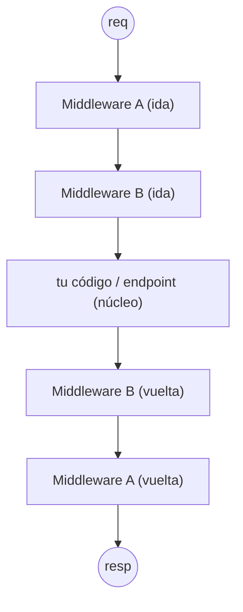
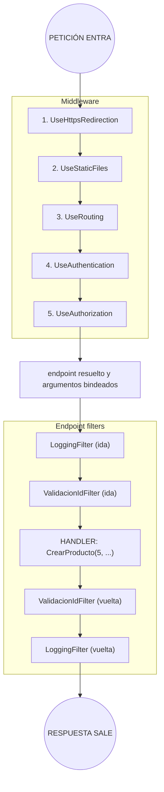

# Middleware y Endpoint Filters desde los primeros principios

---

## Índice

1. [El punto de partida: una petición es un viaje](#1-el-punto-de-partida-una-petición-es-un-viaje)
2. [Qué es el middleware](#2-qué-es-el-middleware)
3. [La forma de un middleware: el patrón de la cebolla](#3-la-forma-de-un-middleware-el-patrón-de-la-cebolla)
4. [El orden importa (y por qué)](#4-el-orden-importa-y-por-qué)
5. [Cortocircuitar: cuando un middleware no llama al siguiente](#5-cortocircuitar-cuando-un-middleware-no-llama-al-siguiente)
6. [Tres formas de escribir un middleware](#6-tres-formas-de-escribir-un-middleware)
7. [El problema que el middleware no resuelve bien](#7-el-problema-que-el-middleware-no-resuelve-bien)
8. [Qué es un endpoint filter](#8-qué-es-un-endpoint-filter)
9. [La forma de un endpoint filter](#9-la-forma-de-un-endpoint-filter)
10. [Encadenar filtros y cortocircuitar](#10-encadenar-filtros-y-cortocircuitar)
11. [Middleware vs. endpoint filter: la diferencia esencial](#11-middleware-vs-endpoint-filter-la-diferencia-esencial)
12. [El recorrido completo de una petición](#12-el-recorrido-completo-de-una-petición)

---

## 1. El punto de partida: una petición es un viaje

Cuando llega una petición HTTP, no salta directo a tu código y vuelve. Hace un **viaje** a través de una serie de etapas, en orden, antes de llegar a la lógica que la atiende, y otro viaje de vuelta con la respuesta. Cada etapa puede mirar la petición, modificarla, decidir frenarla, o dejarla pasar a la siguiente.

ASP.NET Core organiza ese viaje como un **pipeline**: una tubería compuesta por piezas encadenadas, donde la salida de una es la entrada de la siguiente. La petición entra por un extremo, atraviesa las piezas una por una, llega al destino (tu código), y la respuesta hace el camino inverso atravesando las mismas piezas.

Todo lo que sigue son dos formas de meter piezas propias en ese viaje. El **middleware** son piezas en el tramo *general* del viaje, antes de saber siquiera qué código va a atender la petición. Los **endpoint filters** son piezas en el tramo *final*, ya envolviendo el código concreto que la atiende. El primer principio es ese: **son dos puntos distintos del mismo viaje, y por eso ven cosas distintas.**

---

## 2. Qué es el middleware

Un **middleware** es un componente que se sienta en el pipeline de la aplicación y procesa *todas* las peticiones que pasan por él. Es lo primero que toca una petición que entra, y lo último que toca una respuesta que sale.

La palabra describe literalmente su posición: está en el **medio**, entre el servidor que recibe el byte crudo del HTTP y el código de negocio que produce la respuesta. Ejemplos típicos de cosas que se resuelven con middleware: redirigir HTTP a HTTPS, servir archivos estáticos (CSS, imágenes), autenticación, registrar cada petición en un log, capturar excepciones no manejadas.

En `Program.cs`, el pipeline se arma con una serie de llamadas `app.Use...`, y **el orden en que las escribís es el orden del viaje**:

```csharp
var app = builder.Build();

app.UseHttpsRedirection();   // 1ª pieza
app.UseStaticFiles();        // 2ª pieza
app.UseRouting();            // 3ª pieza
app.UseAuthentication();     // 4ª pieza
app.UseAuthorization();      // 5ª pieza

app.MapRazorPages();         // destino final

app.Run();
```

Cada `Use...` agrega una pieza a la tubería. La petición las atraviesa de arriba hacia abajo; la respuesta vuelve de abajo hacia arriba.

> El principio: **el middleware no sabe ni le importa qué código va a atender la petición.** Opera al nivel más bajo y general, sobre la petición cruda. Por eso sirve para cosas que valen para *toda* la app por igual, sin importar si después la atiende una página Razor, una API o un archivo estático.

---

## 3. La forma de un middleware: el patrón de la cebolla

Un middleware no es solo "código que corre antes". Es código que **envuelve** al resto del pipeline, con una parte que corre a la ida y otra a la vuelta. La forma canónica es esta:

```csharp
app.Use(async (context, next) => {
    // (A) Código de IDA: corre ANTES de las piezas siguientes
    Console.WriteLine($"Entrando: {context.Request.Path}");

    await next(context);   // ← le pasa el control a la siguiente pieza

    // (B) Código de VUELTA: corre DESPUÉS de que las siguientes terminaron
    Console.WriteLine($"Saliendo: {context.Response.StatusCode}");
});
```

Hay dos elementos clave:

- **`context`** es el `HttpContext`: el objeto que representa *toda* la petición y la respuesta. Por ahí accedés a la URL, los headers, el cuerpo, el usuario autenticado, y ahí escribís la respuesta. Es el "expediente" que viaja por todo el pipeline.
- **`next`** es el resto del pipeline empaquetado en una función. Llamar a `await next(context)` significa "ahora le toca a la pieza siguiente". Todo lo que escribís *antes* de esa línea corre a la ida; todo lo que escribís *después* corre a la vuelta, cuando las piezas internas ya terminaron.

A esto se lo llama el **patrón de la cebolla**: cada middleware es una capa que envuelve a la de adentro. La petición atraviesa las capas hacia el centro (la parte de ida de cada una), llega al núcleo, y la respuesta sale atravesando las capas en reversa (la parte de vuelta de cada una).



> El principio: **un middleware ve la petición dos veces** —una a la ida, otra a la vuelta— porque rodea a todo lo que está más adentro. Por eso puede, por ejemplo, arrancar un cronómetro a la ida y detenerlo a la vuelta para medir cuánto tardó toda la petición.

---

## 4. El orden importa (y por qué)

Como el pipeline es una secuencia, **el orden de los `app.Use...` cambia el comportamiento**, no es decorativo. Y los errores de orden son una fuente clásica de bugs sutiles.

El ejemplo más claro es autenticación y autorización:

```csharp
app.UseAuthentication();   // PRIMERO: ¿quién sos? (identifica al usuario)
app.UseAuthorization();    // DESPUÉS: ¿podés hacer esto? (chequea permisos)
```

Si las invirtieras, la autorización correría antes de que nadie haya identificado al usuario, así que siempre vería un usuario anónimo y rechazaría todo. El orden codifica una dependencia: no podés preguntar "¿podés?" antes de saber "¿quién sos?".

Otro caso: `UseStaticFiles()` suele ir temprano. Si una petición es para `/css/site.css`, ese middleware la atiende y **cortocircuita** ahí mismo (lo vemos en la sección que sigue), sin molestar al resto del pipeline. Ponerlo temprano evita trabajo innecesario para los archivos estáticos.

> El principio: **el orden del pipeline expresa dependencias y prioridades.** Pensar "¿qué necesita estar resuelto antes de que esta pieza corra?" te dice dónde ubicarla. No es un detalle: es parte de la lógica.

---

## 5. Cortocircuitar: cuando un middleware no llama al siguiente

Hasta acá, cada middleware llamaba a `await next(context)` para pasar el control. Pero un middleware **no está obligado** a hacerlo. Si decide no llamar a `next`, el viaje se detiene ahí: las piezas de adentro nunca corren, y la respuesta empieza a volver desde ese punto. Eso es **cortocircuitar** el pipeline.

```csharp
app.Use(async (context, next) => {
    if (EstaEnMantenimiento()) {
        context.Response.StatusCode = 503;
        await context.Response.WriteAsync("En mantenimiento, volvé más tarde.");
        return;   // ← NO llama a next: corta el pipeline acá
    }

    await next(context);   // si no, sigue normalmente
});
```

Acá, si la app está en mantenimiento, el middleware responde él mismo y nada de lo que está más adentro (ni el ruteo, ni tus páginas) llega a ejecutarse. Cortocircuitar es la herramienta para frenar peticiones que no deben continuar: un usuario no autenticado, un archivo estático ya servido, una petición bloqueada por un límite de tasa.

> El principio: **`next` es una decisión, no un trámite.** Llamarlo deja pasar; no llamarlo corta. Esa simple elección —seguir o frenar— es lo que le da al middleware el poder de actuar como guardián de todo lo que viene después.

---

## 6. Tres formas de escribir un middleware

El delegado inline (`app.Use(async (context, next) => ...)`) es la forma más directa, pero hay tres maneras de escribir middleware, de menor a mayor formalidad:

**1. Inline con `app.Use`** — para lógica chica y puntual, como vimos arriba.

**2. Por convención (una clase)** — para middleware reutilizable. Es una clase normal (no implementa ninguna interfaz) que sigue una convención de nombres: recibe el `next` en el constructor y expone un método `InvokeAsync`.

```csharp
public class LoggingMiddleware {
    private readonly RequestDelegate next;

    public LoggingMiddleware(RequestDelegate next) {
        this.next = next;
    }

    public async Task InvokeAsync(HttpContext context) {
        Console.WriteLine($"→ {context.Request.Method} {context.Request.Path}");
        await this.next(context);
        Console.WriteLine($"← {context.Response.StatusCode}");
    }
}
```

Se enchufa con `app.UseMiddleware<LoggingMiddleware>();`.

**3. Basado en fábrica (`IMiddleware`)** — una clase que implementa la interfaz `IMiddleware`. Conviene cuando el middleware necesita dependencias inyectadas *por petición* (scoped), porque se resuelve desde el contenedor de DI en cada request en vez de una sola vez al arrancar.

> El principio: **las tres hacen lo mismo conceptualmente** —envuelven el pipeline con la lógica de ida/vuelta de la sección 3—. La elección es de empaquetado: inline para lo puntual, clase por convención para lo reutilizable, `IMiddleware` cuando entran en juego dependencias scoped.

---

## 7. El problema que el middleware no resuelve bien

El middleware es potente justamente porque es general: corre antes de saber qué va a atender la petición. Pero esa misma generalidad es su límite.

Imaginá que querés validar los datos de entrada de *una* operación concreta —digamos, que el `id` que llega sea mayor que cero antes de ejecutar el handler que crea un producto. Con middleware esto es incómodo:

- El middleware corre **antes del ruteo** (o al menos antes de que se resuelvan los argumentos del handler), así que **no conoce los parámetros ya convertidos** que va a recibir tu código. Solo ve la petición cruda: tendría que hurgar a mano en la query string o el cuerpo, reparseando lo que el framework va a parsear igual más adelante.
- El middleware corre para **todas** las peticiones. Aplicar una validación que solo tiene sentido en un endpoint significaría meter ahí dentro condiciones del tipo "si la ruta es tal y el método es cual...", lo que ensucia y no escala.
- El middleware trabaja con el `HttpContext` y la respuesta cruda, **no con el valor de retorno** de tu handler. Si quisieras transformar el resultado de un endpoint, tendrías que interceptar el cuerpo de la respuesta ya serializado, que es engorroso.

En resumen: el middleware está demasiado *afuera* y demasiado *temprano* para tareas que dependen de **qué endpoint específico** atiende la petición y de **sus argumentos ya procesados**. Para eso existe la otra herramienta.

---

## 8. Qué es un endpoint filter

Un **endpoint filter** es código que se ejecuta *envolviendo a un endpoint concreto* (o a un grupo de endpoints), no a toda la aplicación. Es la pieza que faltaba: corre **después** de que el ruteo ya decidió qué código atiende la petición y de que los argumentos ya fueron convertidos, pero **antes** de que el handler corra (y también a la vuelta, después de que corre).

La diferencia de posición lo cambia todo. Mientras el middleware vive en el pipeline general y ve peticiones crudas, el endpoint filter vive pegado al endpoint y por eso tiene acceso a:

- **Los argumentos ya convertidos** que va a recibir el handler (el `int id` ya parseado, el objeto ya bindeado), no la petición cruda.
- **El valor de retorno** del handler, que puede inspeccionar o transformar a la vuelta.
- **Solo el endpoint (o grupo) al que lo asociaste**, no toda la app.

Los endpoint filters son la herramienta recomendada en .NET 10 para las llamadas *cross-cutting concerns* (validación, logging, autorización fina) **a nivel de ruta**: cosas que querés aplicar a un endpoint o a un conjunto de ellos, aprovechando que ya sabés qué endpoint es y con qué argumentos.

> El principio: **el endpoint filter sabe lo que el middleware ignora.** Está más adentro y más tarde en el viaje, así que conoce el destino concreto y sus datos ya procesados. Esa cercanía es exactamente su razón de ser.

---

## 9. La forma de un endpoint filter

Un endpoint filter implementa la interfaz `IEndpointFilter`, que define un único método: `InvokeAsync`. La forma es deliberadamente parecida a la del middleware —tiene la misma estructura de ida/vuelta con un `next`— pero trabaja con otros objetos:

```csharp
public class ValidacionIdFilter : IEndpointFilter {
    public async ValueTask<object?> InvokeAsync(
        EndpointFilterInvocationContext context,
        EndpointFilterDelegate next) {

        // (A) IDA: inspeccionar los ARGUMENTOS ya convertidos del handler
        int id = context.GetArgument<int>(0);   // el primer argumento del handler
        if (id <= 0) {
            return Results.BadRequest("El id debe ser mayor que cero.");
            // ← cortocircuita: el handler nunca corre
        }

        // pasa el control al handler (o al siguiente filtro)
        object? resultado = await next(context);

        // (B) VUELTA: puede inspeccionar o transformar el RESULTADO del handler
        return resultado;
    }
}
```

Compará pieza por pieza con el middleware:

| Middleware                        | Endpoint filter                            |
| --------------------------------- | ------------------------------------------ |
| recibe `HttpContext context`      | recibe `EndpointFilterInvocationContext`   |
| `next(context)` → resto del pipeline | `next(context)` → handler o siguiente filtro |
| trabaja con la petición/respuesta cruda | trabaja con los **argumentos** y el **valor de retorno** |
| devuelve `Task` (nada)            | devuelve `ValueTask<object?>` (**el resultado**) |

Las dos diferencias que más importan:

- **`context.GetArgument<T>(indice)`** te da los argumentos del handler ya convertidos a su tipo. No reparseás nada: el framework ya hizo el binding y vos lo recibís listo. Esto es justo lo que el middleware no podía hacer cómodo.
- **El filtro devuelve el resultado** (`object?`). A la ida podés devolver algo *en lugar de* llamar al handler (cortocircuito); a la vuelta podés tomar lo que devolvió el handler y transformarlo antes de que se convierta en respuesta.

Se asocia a un endpoint o a un grupo con `AddEndpointFilter`:

```csharp
// a un endpoint puntual
app.MapPost("/productos/{id}", CrearProducto)
   .AddEndpointFilter<ValidacionIdFilter>();

// a todo un grupo de endpoints
var grupo = app.MapGroup("/productos");
grupo.AddEndpointFilter<ValidacionIdFilter>();   // aplica a todos los del grupo
```

> El principio: **mismo patrón de cebolla, distinto material.** El filtro envuelve al handler igual que el middleware envuelve al pipeline, pero en vez de manipular bytes crudos manipula los argumentos tipados de entrada y el valor de retorno de salida. Por eso es la herramienta natural para validar entradas y dar forma a salidas.

---

## 10. Encadenar filtros y cortocircuitar

Igual que con el middleware, podés poner **varios filtros sobre un mismo endpoint**, y forman su propia cadena. Se ejecutan en el orden en que los agregás (a la ida) y en orden inverso (a la vuelta), exactamente como las capas de la cebolla:

```csharp
app.MapPost("/productos/{id}", CrearProducto)
   .AddEndpointFilter<LoggingFilter>()       // capa externa
   .AddEndpointFilter<ValidacionIdFilter>(); // capa interna
```

A la ida corre primero `LoggingFilter`, después `ValidacionIdFilter`, después el handler; a la vuelta, al revés.

Y como el middleware, **cualquier filtro puede cortocircuitar**: si devuelve un resultado sin llamar a `next(context)`, ni los filtros internos ni el handler llegan a correr. Eso es justo lo que hace el ejemplo de validación de la sección anterior: con un `id` inválido, devuelve `BadRequest` y el handler nunca se ejecuta.

> El principio: **la decisión de seguir o frenar vuelve a estar en `next`.** Toda la familia de mecanismos de pipeline de ASP.NET Core comparte esta mecánica: llamar a `next` deja pasar al siguiente; devolver sin llamarlo, corta. Aprendido una vez, sirve para los dos.

---

## 11. Middleware vs. endpoint filter: la diferencia esencial

Ahora que viste los dos, la distinción se puede resumir en una idea: **a qué altura del viaje viven, y por eso qué pueden ver.**

| Aspecto                  | Middleware                                  | Endpoint filter                                  |
| ------------------------ | ------------------------------------------- | ------------------------------------------------ |
| Alcance                  | Toda la app (todas las peticiones)          | Un endpoint o un grupo                           |
| Cuándo corre             | Temprano, antes de saber el endpoint        | Tarde, ya conocido el endpoint y sus argumentos  |
| Qué ve                   | Petición/respuesta crudas (`HttpContext`)   | Argumentos ya convertidos y valor de retorno     |
| Sirve para               | Concerns globales: HTTPS, archivos estáticos, auth general, logging, manejo de errores | Concerns por ruta: validar entradas, transformar resultados, lógica específica del endpoint |
| Se enchufa con           | `app.Use...` en `Program.cs`                | `.AddEndpointFilter<T>()` sobre el endpoint/grupo |
| Funciona con             | Cualquier estilo (Razor Pages, MVC, APIs, Blazor) | Endpoints (Minimal APIs, y también MVC/Razor Pages) |

La forma más simple de elegir: **si lo que querés hacer vale para toda la aplicación y no necesita saber qué endpoint atiende ni sus argumentos, es middleware. Si depende del endpoint concreto o de sus parámetros ya procesados, es un endpoint filter.**

Una imagen que ayuda: el middleware es el **control de seguridad del aeropuerto** —todos pasan por él, sin importar el vuelo—; el endpoint filter es el **chequeo en la puerta de embarque** de tu vuelo específico, que ya sabe a dónde vas y revisa tu tarjeta concreta.

> El principio: **no compiten, se complementan.** Casi toda app real usa los dos: middleware para lo transversal y general, filtros para lo específico de cada ruta. No es "cuál es mejor" sino "cuál es la altura correcta del viaje para este trabajo".

---

## 12. El recorrido completo de una petición

Cerremos atando todo en un viaje de punta a punta. Llega `POST /productos/5` con un cuerpo JSON:



Leído así, el modelo es uno solo y consistente: **un viaje con capas anidadas, donde cada capa corre a la ida y a la vuelta, y donde llamar a `next` deja pasar y no llamarlo corta.** El middleware son las capas externas y generales; los endpoint filters, las capas internas y específicas de cada endpoint. Entendido el patrón de la cebolla una vez, las dos herramientas se vuelven la misma idea aplicada a dos alturas distintas del recorrido.

---

## Resumen de los principios

| Concepto             | Regla en una frase                                                                |
| -------------------- | --------------------------------------------------------------------------------- |
| Pipeline             | La petición hace un viaje por capas anidadas: ida hacia el núcleo, vuelta hacia afuera. |
| Middleware           | Capa general que ve la petición cruda; corre para toda la app, antes de saber el endpoint. |
| Patrón de la cebolla | El código antes de `next` corre a la ida; el código después, a la vuelta.         |
| Orden                | La secuencia de `app.Use...` expresa dependencias y prioridades, no es decorativa.|
| Cortocircuito        | No llamar a `next` frena el viaje y empieza el regreso desde esa capa.            |
| Endpoint filter      | Capa pegada a un endpoint que ve los argumentos convertidos y el valor de retorno.|
| Elección             | Global y sin conocer el endpoint → middleware. Por ruta o según argumentos → endpoint filter. |

---

*Programación III — Tecnicatura Universitaria en Programación — UTN, Facultad Regional Tucumán.*
