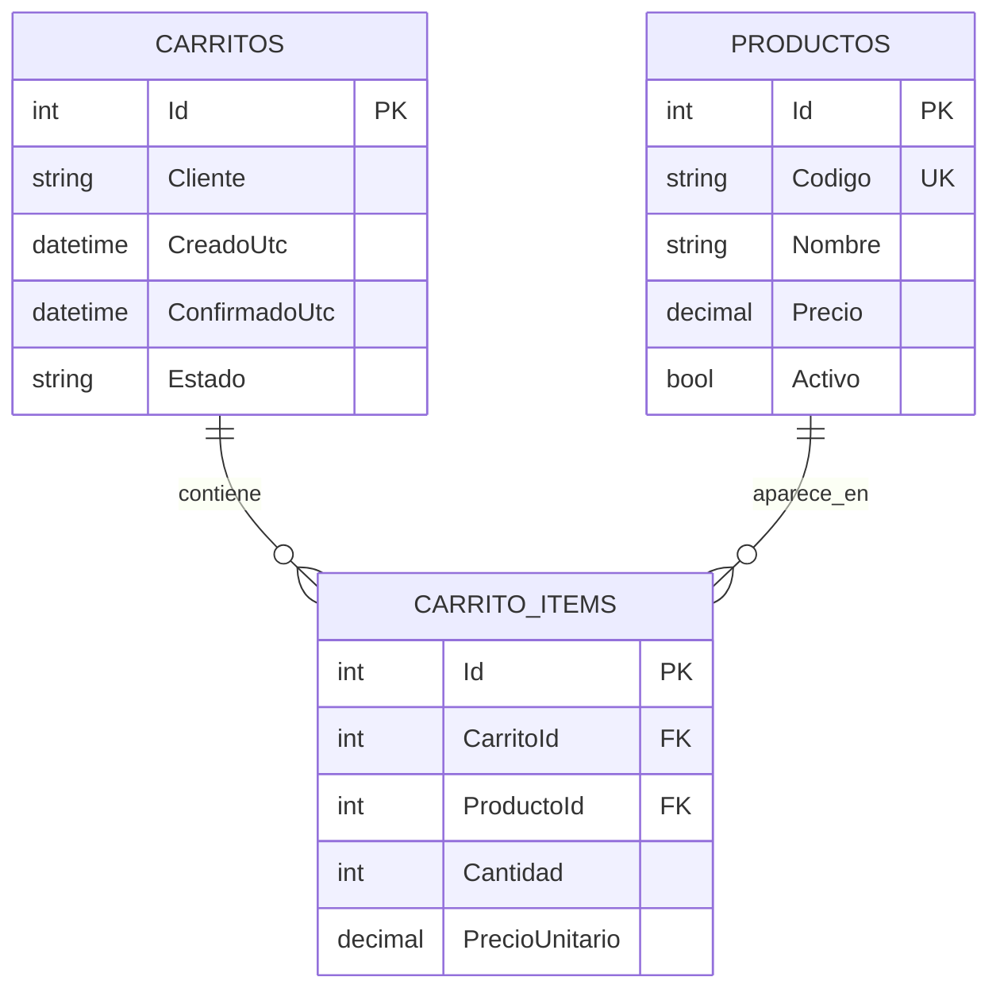

# Carrito de compras con EF Core y SQLite

## Decisiones de diseño para construir sistemas mantenibles

> Caso base: [`clases/30.1-carrito.cs`](../clases/30.1-carrito.cs)
>
> C# / .NET / Entity Framework Core / SQLite

---

## 1. Qué problema resuelve este programa

El programa implementa un carrito de compras mínimo:

- Carga un catálogo de productos.
- Crea un carrito para un cliente.
- Agrega productos al carrito.
- Quita parte de una cantidad.
- Muestra el total.
- Confirma la compra.
- Guarda todo en una base SQLite usando Entity Framework Core.

Aunque es un ejemplo chico, contiene decisiones que aparecen en sistemas reales:

- Cómo modelar entidades y relaciones.
- Dónde poner reglas de negocio.
- Cómo validar entradas.
- Cómo persistir datos sin mezclar SQL manual con la lógica principal.
- Cómo evitar duplicación y errores silenciosos.
- Cómo dejar una base clara para crecer después.

La idea central del diseño es esta:

> El programa de consola muestra el flujo; el servicio aplica las reglas; las entidades representan el dominio; el `DbContext` sabe cómo guardar ese modelo en la base.

---

## 2. Arquitectura general

El archivo está organizado en cuatro capas simples:

```text
Programa principal
    Muestra el flujo de uso del carrito.

Funciones de presentación
    Imprimen catálogo, carrito y confirmación.

TiendaService
    Contiene las operaciones y reglas del sistema.

Entidades + DbContext
    Representan el modelo y su mapeo a SQLite.
```

Esta separación importa porque evita que todo quede mezclado. Si mañana el programa deja de ser una consola y pasa a ser una API, una app web o una app de escritorio, gran parte del código de dominio podría seguir sirviendo.

---

## 3. El programa principal como guion de uso

La primera parte del archivo funciona como un guion:

```csharp
var dbPath = ResolverRutaDb();

using var context = new TiendaContext(dbPath);

context.Database.EnsureDeleted();
context.Database.EnsureCreated();

var tienda = new TiendaService(context);

CargarCatalogo(tienda);
MostrarCatalogo(tienda.ListarCatalogo());

var carrito = tienda.CrearCarrito("Ada Lovelace");

tienda.AgregarItem(carrito.Id, "NOTE-15", 1);
tienda.AgregarItem(carrito.Id, "MOUSE-WL", 2);
tienda.AgregarItem(carrito.Id, "USB-C", 3);
tienda.EliminarItem(carrito.Id, "USB-C", 1);

var carritoActual = tienda.ObtenerCarrito(carrito.Id);
MostrarCarrito(carritoActual);

var carritoConfirmado = tienda.ConfirmarCompra(carrito.Id);
MostrarConfirmacion(carritoConfirmado);
```

Esta parte no debería conocer detalles internos de la base. No hace `INSERT`, no calcula claves foráneas, no decide si un carrito está abierto o confirmado. Solo expresa el caso de uso.

Esa es una buena práctica general:

> El código que coordina una pantalla, una consola o un endpoint debería leer como una historia de usuario, no como una mezcla de reglas, SQL y validaciones.

---

## 4. SQLite al lado del archivo fuente

El método `ResolverRutaDb` usa `CallerFilePath`:

```csharp
static string ResolverRutaDb([CallerFilePath] string sourceFile = "") {
    var directory = Path.GetDirectoryName(sourceFile) ?? Environment.CurrentDirectory;
    return Path.Combine(directory, "30.1-carrito.sqlite");
}
```

La decisión es guardar la base SQLite junto al archivo `.cs`.

Ventajas para una clase o demo:

- Es fácil encontrar la base generada.
- No depende del directorio desde donde se ejecute `dotnet run`.
- Evita rutas absolutas hardcodeadas.
- Permite borrar y recrear el archivo sin afectar otras partes del proyecto.

En un sistema real, esta decisión cambiaría. La ruta debería venir de configuración:

- `appsettings.json`
- variable de entorno
- argumentos de línea de comandos
- secretos del entorno de despliegue

Principio reutilizable:

> Para un ejemplo, una ruta local y predecible ayuda. Para producción, la configuración no debe estar fija en el código.

---

## 5. `EnsureDeleted` y `EnsureCreated`: bueno para aprender, no para producción

El programa hace esto:

```csharp
context.Database.EnsureDeleted();
context.Database.EnsureCreated();
```

Eso borra la base y la crea de nuevo cada vez.

Es correcto para este caso porque queremos una demo repetible: cada ejecución arranca limpia, carga los mismos productos y muestra el mismo flujo.

Pero no es correcto para un sistema real. En producción, borrar la base significaría perder datos. Para proyectos reales se usan migraciones:

```bash
dotnet ef migrations add Inicial
dotnet ef database update
```

Principio reutilizable:

> `EnsureCreated` sirve para prototipos, pruebas simples y clases. Las migraciones sirven para sistemas que evolucionan sin perder datos.

---

## 6. Modelado del dominio

El modelo tiene cuatro piezas principales:



El diagrama muestra tres tablas persistidas:

- `Productos`: catálogo de productos disponibles.
- `Carritos`: encabezado del carrito, cliente, fecha y estado.
- `CarritoItems`: detalle del carrito; une un carrito con un producto y agrega cantidad y precio unitario.

`Subtotal` y `Total` no aparecen en el gráfico porque no son columnas de la base. Son propiedades calculadas en C# marcadas con `[NotMapped]`.

```csharp
enum EstadoCarrito {
    Abierto = 1,
    Confirmado = 2
}
```

```csharp
class Producto {
    public int Id { get; set; }
    public string Codigo { get; set; } = string.Empty;
    public string Nombre { get; set; } = string.Empty;
    public decimal Precio { get; set; }
    public bool Activo { get; set; } = true;

    public ICollection<CarritoItem> ItemsCarrito { get; set; } = [];
}
```

```csharp
class Carrito {
    public int Id { get; set; }
    public string Cliente { get; set; } = string.Empty;
    public DateTime CreadoUtc { get; set; } = DateTime.UtcNow;
    public DateTime? ConfirmadoUtc { get; set; }
    public EstadoCarrito Estado { get; set; } = EstadoCarrito.Abierto;

    public ICollection<CarritoItem> Items { get; set; } = [];

    [NotMapped]
    public decimal Total => Items.Sum(item => item.Subtotal);
}
```

```csharp
class CarritoItem {
    public int Id { get; set; }
    public int CarritoId { get; set; }
    public int ProductoId { get; set; }
    public int Cantidad { get; set; }
    public decimal PrecioUnitario { get; set; }

    public Carrito Carrito { get; set; } = null!;
    public Producto Producto { get; set; } = null!;

    [NotMapped]
    public decimal Subtotal => PrecioUnitario * Cantidad;
}
```

### 6.1 Por qué existe `CarritoItem`

Una primera idea podría ser que `Carrito` tenga una lista directa de `Producto`:

```csharp
class Carrito {
    public List<Producto> Productos { get; set; }
}
```

Pero eso no alcanza. En un carrito no solo importa qué producto está incluido, también importa:

- cantidad
- precio unitario al momento de agregarlo
- subtotal
- relación entre un carrito específico y un producto específico

Por eso se modela una entidad intermedia: `CarritoItem`.

Principio reutilizable:

> Cuando una relación necesita datos propios, deja de ser una lista directa y pasa a ser una entidad del dominio.

Ejemplos similares:

- `FacturaDetalle`: factura + producto + cantidad + precio.
- `Inscripcion`: alumno + curso + fecha + estado.
- `ReservaHabitacion`: reserva + habitacion + noches + tarifa.

### 6.2 Por qué `PrecioUnitario` está en el item

El producto ya tiene `Precio`, pero el item también guarda `PrecioUnitario`.

Esto parece duplicación, pero es una decisión correcta. El precio del producto puede cambiar mañana. Si el carrito o la compra ya fue confirmada, no queremos que el total histórico cambie porque alguien actualizó el catálogo.

Entonces:

- `Producto.Precio` representa el precio actual de catálogo.
- `CarritoItem.PrecioUnitario` representa el precio usado en ese carrito.

Principio reutilizable:

> En operaciones históricas, guardar snapshots de datos importantes suele ser mejor que depender siempre del valor actual.

Esto aplica a precios, nombres legales, direcciones de envío, impuestos, descuentos y cotizaciones.

### 6.3 Por qué se usa `decimal` para dinero

Los precios son `decimal`, no `double`.

```csharp
public decimal Precio { get; set; }
public decimal PrecioUnitario { get; set; }
```

`double` sirve para cálculos científicos aproximados. Para dinero necesitamos precisión decimal predecible.

Principio reutilizable:

> Para dinero, usar `decimal`. Para mediciones físicas o cálculos aproximados, usar `double`.

### 6.4 Por qué hay propiedades calculadas

`Subtotal` y `Total` no se guardan como columnas:

```csharp
[NotMapped]
public decimal Subtotal => PrecioUnitario * Cantidad;
```

```csharp
[NotMapped]
public decimal Total => Items.Sum(item => item.Subtotal);
```

Se calculan a partir de datos existentes. Guardarlos en la base generaría riesgo de inconsistencia:

- cambia la cantidad pero no se actualiza el subtotal
- cambia un item pero no se recalcula el total
- se guarda un total distinto a la suma real

`[NotMapped]` le indica a EF Core que esa propiedad pertenece al modelo de objetos, pero no al esquema de la base.

Principio reutilizable:

> Si un dato se puede calcular siempre desde otros datos confiables, no lo guardes salvo que tengas una razón concreta de rendimiento, auditoría o cierre contable.

---

## 7. Estados explícitos en vez de booleanos ambiguos

El carrito tiene un estado:

```csharp
public EstadoCarrito Estado { get; set; } = EstadoCarrito.Abierto;
```

Podríamos haber usado:

```csharp
public bool Confirmado { get; set; }
```

Pero un `enum` deja mejor preparada la evolución del sistema. Hoy hay dos estados:

- `Abierto`
- `Confirmado`

Mañana podría haber más:

- `Cancelado`
- `Expirado`
- `Pagado`
- `Enviado`

Principio reutilizable:

> Cuando una entidad atraviesa etapas de negocio, un `enum` suele expresar mejor el modelo que varios booleanos.

Evitar modelos como:

```csharp
bool Confirmado;
bool Cancelado;
bool Pagado;
```

porque pueden aparecer combinaciones inválidas:

```text
Confirmado = true
Cancelado = true
Pagado = false
```

Un único estado reduce esa ambigüedad.

---

## 8. Reglas de negocio dentro del servicio

`TiendaService` concentra las operaciones importantes:

- crear producto
- listar catálogo
- crear carrito
- obtener carrito
- agregar item
- eliminar item
- confirmar compra

Ejemplo:

```csharp
public void AgregarItem(int carritoId, string codigoProducto, int cantidad) {
    if (cantidad <= 0) {
        throw new ArgumentOutOfRangeException(nameof(cantidad), "La cantidad debe ser mayor a cero.");
    }

    var carrito = ObtenerCarrito(carritoId);
    ValidarCarritoAbierto(carrito);

    var producto = ObtenerProductoPorCodigo(codigoProducto);

    var existente = carrito.Items.SingleOrDefault(item => item.ProductoId == producto.Id);
    if (existente is null) {
        carrito.Items.Add(new CarritoItem {
            ProductoId = producto.Id,
            Cantidad = cantidad,
            PrecioUnitario = producto.Precio
        });
    } else {
        existente.Cantidad += cantidad;
    }

    context.SaveChanges();
}
```

Esta decisión evita que el programa principal tenga que saber:

- cómo se busca un producto
- cómo se valida la cantidad
- cómo se sabe si un carrito admite cambios
- cómo se agrega o actualiza un item
- cuándo se llama a `SaveChanges`

Principio reutilizable:

> Las pantallas, endpoints o comandos deberían pedir operaciones al servicio. El servicio debería proteger las reglas del sistema.

---

## 9. Validación y normalización centralizadas

El servicio tiene dos helpers:

```csharp
static string NormalizarCodigo(string codigo) {
    return Requerido(codigo, nameof(codigo), "El codigo del producto es obligatorio.").ToUpperInvariant();
}
```

```csharp
static string Requerido(string valor, string parametro, string mensaje) {
    if (string.IsNullOrWhiteSpace(valor)) {
        throw new ArgumentException(mensaje, parametro);
    }

    return valor.Trim();
}
```

Esto evita repetir en todos lados:

```csharp
codigo.Trim().ToUpperInvariant()
```

También evita errores sutiles. Por ejemplo:

```csharp
CrearProducto("note-15", "Notebook", 1000m);
AgregarItem(carrito.Id, "NOTE-15", 1);
```

Si no normalizamos de forma consistente, esos dos códigos podrían tratarse como distintos. Con `NormalizarCodigo`, ambos terminan siendo `NOTE-15`.

Principio reutilizable:

> Cada dato con identidad de negocio necesita una regla única de normalización.

Ejemplos:

- códigos de producto
- emails
- CUIT/CUIL
- patentes
- nombres de usuario
- SKU

---

## 10. Errores claros en vez de excepciones accidentales

Cuando una búsqueda puede fallar, el programa evita depender de la excepción genérica de `Single`.

En vez de:

```csharp
var producto = context.Productos.Single(producto => producto.Codigo == codigo);
```

usa:

```csharp
var producto = context.Productos.SingleOrDefault(producto => producto.Codigo == codigoNormalizado);

return producto ?? throw new InvalidOperationException($"No existe el producto {codigoNormalizado}.");
```

La diferencia es importante. El primer caso falla con un mensaje técnico como "Sequence contains no elements". El segundo caso dice qué regla de negocio no se pudo cumplir.

Principio reutilizable:

> Las excepciones que llegan desde el dominio deben explicar el problema del dominio.

No es lo mismo:

```text
Sequence contains no elements.
```

que:

```text
No existe el producto NOTE-15.
```

---

## 11. Carga de datos relacionados con `Include`

Para mostrar el carrito necesitamos sus items y los productos de esos items.

```csharp
public Carrito ObtenerCarrito(int carritoId) {
    var carrito = context.Carritos
        .Include(carrito => carrito.Items)
        .ThenInclude(item => item.Producto)
        .SingleOrDefault(carrito => carrito.Id == carritoId);

    return carrito ?? throw new InvalidOperationException($"No existe el carrito #{carritoId}.");
}
```

`Include` le dice a EF Core que cargue datos relacionados en la misma operación lógica.

Sin eso, dependiendo de la configuración, `carrito.Items` podría venir vacío o no estar cargado. En este ejemplo se elige ser explícito.

Principio reutilizable:

> Cuando un caso de uso necesita un agregado completo, cargalo explícitamente con sus relaciones necesarias.

Para este carrito, el agregado útil es:

```text
Carrito
  Items
    Producto
```

---

## 12. Consultas de solo lectura con `AsNoTracking`

El catálogo se lista así:

```csharp
public IReadOnlyList<Producto> ListarCatalogo() {
    return context.Productos
        .AsNoTracking()
        .OrderBy(producto => producto.Nombre)
        .ToList();
}
```

`AsNoTracking` le dice a EF Core:

> No necesito modificar estas entidades después de leerlas.

Esto reduce trabajo interno del `DbContext`. En un sistema chico no se nota, pero es una buena costumbre en consultas de lectura.

Principio reutilizable:

> Si una consulta solo muestra datos y no va a modificarlos, usar `AsNoTracking`.

---

## 13. Configuración del modelo con Fluent API

El `DbContext` define el mapeo:

```csharp
class TiendaContext(string dbPath) : DbContext {
    public DbSet<Producto> Productos => Set<Producto>();
    public DbSet<Carrito> Carritos => Set<Carrito>();
    public DbSet<CarritoItem> CarritoItems => Set<CarritoItem>();

    protected override void OnConfiguring(DbContextOptionsBuilder optionsBuilder) {
        optionsBuilder.UseSqlite($"Data Source={dbPath}");
    }

    protected override void OnModelCreating(ModelBuilder modelBuilder) {
        // configuracion de tablas, claves, indices, relaciones
    }
}
```

La Fluent API permite configurar la base sin llenar las entidades de atributos.

### 13.1 Índice único para código de producto

```csharp
entity.HasIndex(producto => producto.Codigo).IsUnique();
```

Esto protege la regla:

> No pueden existir dos productos con el mismo código.

No alcanza con validarlo en C#. La base también debe protegerlo.

Principio reutilizable:

> Las reglas de unicidad importantes deben vivir también en la base de datos.

### 13.2 Longitudes máximas

```csharp
entity.Property(producto => producto.Codigo).IsRequired().HasMaxLength(20);
entity.Property(producto => producto.Nombre).IsRequired().HasMaxLength(120);
```

Esto documenta y limita el modelo. Si el código de producto no debería tener 500 caracteres, la base tampoco debería aceptarlo.

Principio reutilizable:

> Si una propiedad tiene límites reales, exprésalos en el modelo y en la base.

### 13.3 Precisión decimal

```csharp
entity.Property(producto => producto.Precio).HasPrecision(10, 2);
entity.Property(item => item.PrecioUnitario).HasPrecision(10, 2);
```

Esto indica hasta 10 dígitos, con 2 decimales.

Para dinero, conviene ser explícito. No todos los motores tratan los decimales igual.

### 13.4 Estado como texto

```csharp
entity.Property(carrito => carrito.Estado).HasConversion<string>().HasMaxLength(20);
```

EF Core podría guardar el enum como número:

```text
1
2
```

Pero acá se guarda como texto:

```text
Abierto
Confirmado
```

Ventajas:

- La base es más legible.
- Los datos son más fáciles de inspeccionar.
- Evita confusiones si cambia el valor numérico del enum.

Costo:

- Ocupa un poco más de espacio.

Para este sistema, la legibilidad vale más que ese costo.

### 13.5 Relación única entre carrito y producto

```csharp
entity.HasIndex(item => new { item.CarritoId, item.ProductoId }).IsUnique();
```

Esta regla evita que el mismo producto aparezca dos veces en el mismo carrito.

En vez de tener:

```text
NOTE-15 x 1
NOTE-15 x 2
```

el sistema mantiene:

```text
NOTE-15 x 3
```

Principio reutilizable:

> Si dos filas duplicadas significarían un error de negocio, exprésalo con un índice único.

### 13.6 Borrado en cascada y borrado restringido

```csharp
entity.HasOne(item => item.Carrito)
    .WithMany(carrito => carrito.Items)
    .HasForeignKey(item => item.CarritoId)
    .OnDelete(DeleteBehavior.Cascade);
```

Si se borra un carrito, tiene sentido borrar sus items. Un item no existe por sí solo.

```csharp
entity.HasOne(item => item.Producto)
    .WithMany(producto => producto.ItemsCarrito)
    .HasForeignKey(item => item.ProductoId)
    .OnDelete(DeleteBehavior.Restrict);
```

Si se intenta borrar un producto usado por carritos, se restringe el borrado. Esto protege el historial.

Principio reutilizable:

> El comportamiento de borrado debe reflejar dependencia real entre entidades.

Regla práctica:

- Si una entidad hija no tiene sentido sin la padre, cascada.
- Si una entidad referenciada forma parte del historial, restringir.

---

## 14. Confirmar una compra

Confirmar no borra el carrito ni crea otra estructura. Cambia su estado:

```csharp
public Carrito ConfirmarCompra(int carritoId) {
    var carrito = ObtenerCarrito(carritoId);
    ValidarCarritoAbierto(carrito);

    if (!carrito.Items.Any()) {
        throw new InvalidOperationException("No se puede confirmar una compra con el carrito vacio.");
    }

    carrito.Estado = EstadoCarrito.Confirmado;
    carrito.ConfirmadoUtc = DateTime.UtcNow;

    context.SaveChanges();

    return ObtenerCarrito(carritoId);
}
```

Hay tres reglas:

- Solo se puede confirmar un carrito abierto.
- No se puede confirmar un carrito vacío.
- Al confirmar, se guarda fecha UTC.

La fecha se guarda en UTC porque es la forma más estable de persistir tiempos.

Principio reutilizable:

> Guardar fechas en UTC y convertir a hora local solo al mostrar.

---

## 15. Invariantes del sistema

Una invariante es una regla que debe cumplirse siempre.

En este programa aparecen varias:

- Un producto debe tener código.
- Un producto debe tener nombre.
- Un producto debe tener precio mayor a cero.
- Un código de producto se guarda normalizado.
- Un carrito debe tener cliente.
- Un item debe tener cantidad mayor a cero.
- Un carrito confirmado no admite cambios.
- Un carrito vacío no se puede confirmar.
- Un mismo producto no debe aparecer dos veces en el mismo carrito.

Algunas invariantes se protegen en C#:

```csharp
if (cantidad <= 0) {
    throw new ArgumentOutOfRangeException(nameof(cantidad), "La cantidad debe ser mayor a cero.");
}
```

Otras se protegen en la base:

```csharp
entity.HasIndex(item => new { item.CarritoId, item.ProductoId }).IsUnique();
```

Principio reutilizable:

> Las reglas importantes deben estar cerca del dominio y, cuando corresponde, reforzadas por la base de datos.

---

## 16. Qué se podría mejorar en una versión real

Este ejemplo está pensado para aprender. Si lo lleváramos hacia un sistema real, agregaríamos varias piezas.

### 16.1 Migraciones

Reemplazar:

```csharp
EnsureDeleted();
EnsureCreated();
```

por migraciones versionadas.

### 16.2 Inyección de dependencias

En una API o app web, `TiendaContext` y `TiendaService` se registrarían en el contenedor:

```csharp
builder.Services.AddDbContext<TiendaContext>(...);
builder.Services.AddScoped<TiendaService>();
```

### 16.3 Transacciones explícitas

Para flujos más complejos, como confirmar compra y descontar stock, convendría usar una transacción explícita.

### 16.4 Stock

Agregar stock implica nuevas reglas:

- no vender más de lo disponible
- descontar al confirmar
- decidir qué pasa si dos usuarios compran al mismo tiempo

### 16.5 Usuarios reales

`Cliente` hoy es un string. En un sistema real probablemente sería una entidad:

```text
Cliente
  Id
  Nombre
  Email
  Direcciones
```

### 16.6 Pagos y auditoría

Confirmar carrito no es lo mismo que pagar. Un sistema real podría separar:

- carrito armado
- orden creada
- pago pendiente
- pago aprobado
- factura emitida

### 16.7 Tests

Las reglas de `TiendaService` son buenos candidatos para tests:

- agregar item nuevo
- sumar cantidad si el item ya existe
- eliminar parcialmente
- eliminar completamente
- impedir modificar carrito confirmado
- impedir confirmar carrito vacío

---

## 17. Checklist para futuros sistemas

Cuando modeles otro sistema, podés usar esta lista:

1. Identificar entidades principales.
2. Identificar relaciones entre entidades.
3. Detectar si alguna relación necesita datos propios.
4. Elegir tipos adecuados (`decimal` para dinero, `DateTime` UTC para timestamps).
5. Definir estados explícitos con `enum` cuando haya ciclo de vida.
6. Centralizar normalización de identificadores de negocio.
7. Validar entradas en el servicio o capa de aplicación.
8. Evitar que la UI o consola contenga reglas de negocio.
9. Usar `AsNoTracking` en consultas de lectura.
10. Usar `Include` cuando el caso de uso necesita relaciones cargadas.
11. Configurar índices únicos para reglas de unicidad.
12. Configurar precisión, longitudes y obligatoriedad.
13. Pensar el comportamiento de borrado antes de elegir cascada o restricción.
14. Guardar datos históricos importantes como snapshots.
15. Usar errores con mensajes del dominio.
16. Usar migraciones en sistemas persistentes.
17. Escribir tests para invariantes importantes.

---

## 18. Resumen de las decisiones más importantes

| Decisión | Motivo |
|---|---|
| `CarritoItem` como entidad | La relación carrito-producto necesita cantidad y precio propio. |
| `PrecioUnitario` en el item | Congela el precio usado en ese carrito. |
| `decimal` para precios | Evita errores de precisión de `double`. |
| `EstadoCarrito` como enum | Modela el ciclo de vida mejor que booleanos. |
| `Subtotal` y `Total` calculados | Evita duplicar datos derivados en la base. |
| `TiendaService` | Centraliza reglas y operaciones del sistema. |
| Normalización de código | Evita duplicados e inconsistencias por mayúsculas o espacios. |
| Errores explícitos | Hace que las fallas expliquen el problema real. |
| `AsNoTracking` | Mejora consultas de solo lectura. |
| `Include` | Carga relaciones necesarias de forma explícita. |
| Índices únicos | La base protege reglas de negocio. |
| `DeleteBehavior.Cascade` para items | Un item no tiene sentido sin su carrito. |
| `DeleteBehavior.Restrict` para productos | Protege historial de carritos existentes. |
| UTC para fechas | Evita ambigüedades de zona horaria. |

---

## 19. Idea final

Este programa no intenta ser un ecommerce completo. Su valor está en mostrar una estructura sana:

```text
Modelo claro
+ reglas centralizadas
+ persistencia configurada
+ errores comprensibles
+ datos históricos protegidos
= base reutilizable para sistemas más grandes
```

Cuando un sistema crece, los problemas no aparecen solamente por falta de tecnologías. Aparecen porque las reglas están mezcladas, los datos no tienen límites claros, las relaciones están mal modeladas o la base no protege lo que el dominio necesita.

El objetivo de este ejemplo es entrenar esa mirada: antes de escribir mucho código, entender qué cosas existen, qué reglas las gobiernan y dónde conviene ubicar cada responsabilidad.
