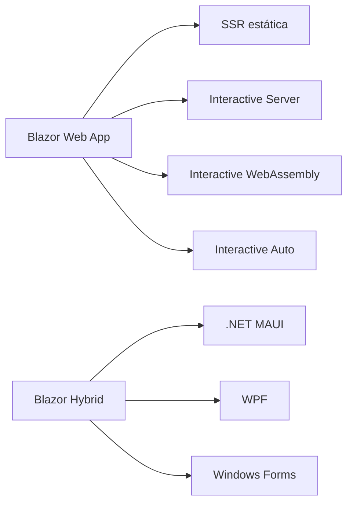
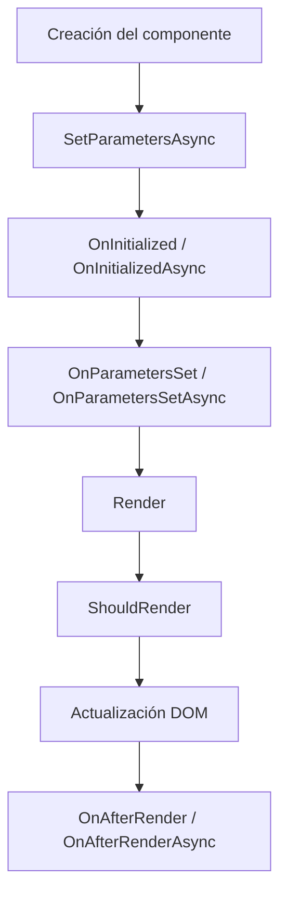
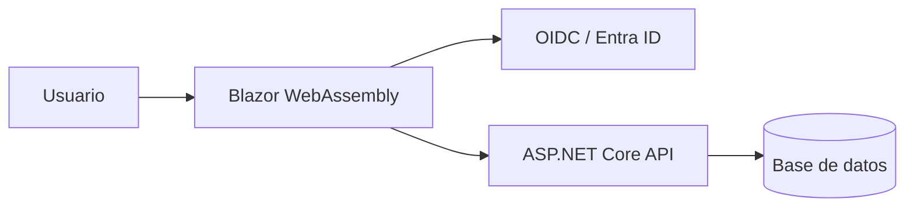

# Tutorial completo y didáctico para aprender Blazor

## Resumen ejecutivo

Blazor ya no conviene enseñarlo como “dos mundos separados” sino como un ecosistema con una plantilla moderna unificada: **Blazor Web App**. Desde .NET 8, esa plantilla permite combinar renderizado estático del servidor, interactividad en servidor e interactividad en WebAssembly por componente o por página, mientras que **Blazor Server**, **Blazor WebAssembly** y **Blazor Hybrid** siguen siendo modelos válidos para elegir despliegue, capacidad offline, acceso a APIs nativas y estrategia de escalado. Para una ruta formativa que realmente funcione en 2026, la combinación más sólida para empezar es **.NET 10 LTS + Visual Studio 2022 17.14 o VS Code con C# Dev Kit**, dejando **.NET 8 LTS** como alternativa de compatibilidad temporal.

La recomendación didáctica central de este informe es esta: empezar con **Interactive Server** porque reduce fricción inicial, seguir con componentes, routing y formularios, pasar luego a **HTTP/SignalR/estado**, y dedicar un módulo completo a **autenticación y autorización**. Esa prioridad no es caprichosa: la documentación actual de Microsoft separa claramente las decisiones de seguridad según el modelo de hospedaje, y la evidencia académica muestra que la autenticación en Blazor WebAssembly ha sido uno de los puntos donde más tropiezan los equipos.

En términos pedagógicos, el curso ideal para alguien con conocimientos básicos de C# y HTML/CSS debe cerrar con tres proyectos integradores: un **CRUD** con Blazor Web App e Interactive Server, una **SPA con API y JWT** en Blazor WebAssembly, y una **PWA** con soporte offline y despliegue contenedorizado. Esa secuencia cubre lo esencial del framework, sus variantes reales de producción y las decisiones de arquitectura que Microsoft hoy considera prácticas: componentes reutilizables, separación lógica entre núcleo e infraestructura, y cuando corresponde, patrón **BFF** para llamadas seguras a APIs con OIDC o Microsoft Entra ID.

## Índice navegable

- [Resumen ejecutivo](#resumen-ejecutivo)
- [Perfil de entrada y entorno de desarrollo](#perfil-de-entrada-y-entorno-de-desarrollo)
- [Fundamentos de Blazor](#fundamentos-de-blazor)
- [Tutorial paso a paso](#tutorial-paso-a-paso)
- [Proyectos integradores y despliegue](#proyectos-integradores-y-despliegue)

## Perfil de entrada y entorno de desarrollo

El público objetivo razonable para este tutorial es quien ya puede leer C# básico, entiende HTML/CSS y quiere construir interfaces web interactivas con .NET sin arrancar desde JavaScript puro. No hace falta asumir más que eso; de hecho, la propia ruta de aprendizaje oficial de Microsoft para introducir Blazor está pensada para perfiles principiantes.

### Público objetivo y requisitos previos

| Aspecto                    | Recomendación                                                                                                                                                          |
| ---                        | ---                                                                                                                                                                    |
| Público objetivo           | Desarrolladores .NET junior/intermedios, equipos back-end que quieren hacer UI web con C#, docentes técnicos y perfiles que migran desde MVC/Razor Pages a componentes |
| Requisitos previos mínimos | C# básico, HTML/CSS básico, nociones elementales de HTTP                                                                                                               |
| Requisitos recomendados    | LINQ básico, JSON, nociones de APIs REST, Git                                                                                                                          |
| No asumir                  | JavaScript avanzado, React/Vue/Angular, arquitectura distribuida                                                                                                       |

La reducción deliberada de prerrequisitos es importante porque Blazor se apoya en componentes Razor, DI, formularios y autorización de ASP.NET Core, es decir, en un stack coherente que favorece enseñar conceptos progresivamente en la misma plataforma.

### Entorno de desarrollo recomendado

| Elemento                              | Recomendación práctica                                                                                               |
| ---                                   | ---                                                                                                                  |
| SDK principal                         | **.NET 10 LTS** para nuevos cursos y proyectos                                                                       |
| SDK alternativo                       | **.NET 8 LTS** si tu organización aún no migró; sigue soportado hasta 2026-11-10                                     |
| SDK a evitar como base de curso largo | **.NET 9 STS**, porque tiene soporte más corto y llega a fin de soporte en 2026-11-10                                |
| Visual Studio                         | **Visual Studio 2022 17.14**                                                                                         |
| VS Code                               | VS Code + **C# Dev Kit**                                                                                             |
| Extensión para Hybrid en VS Code      | **.NET MAUI extension**                                                                                              |
| Workload WebAssembly                  | instalar `wasm-tools` o activar **.NET WebAssembly build tools**                                                     |
| Sistemas operativos                   | Windows, Linux y macOS para ASP.NET Core; para Blazor Hybrid con .NET MAUI hay requisitos por plataforma específicos |

### Mapa actual de Blazor



La clave conceptual es esta: **Blazor Web App** unifica la experiencia web moderna, mientras que **Blazor Hybrid** sigue siendo la vía para UI compartida dentro de aplicaciones nativas. En otras palabras, hoy conviene enseñar primero la plantilla unificada y luego explicar cómo esa misma base se proyecta hacia Server, WebAssembly o Hybrid según el contexto de despliegue.

### Comparación entre Blazor Server, WebAssembly y Hybrid

| Modalidad              | Cómo ejecuta el código                                            | Ventajas principales                                                                                          | Limitaciones principales                                                                                | Casos de uso recomendados                                                       | Base documental                             |
| ---                    | ---                                                               | ---                                                                                                           | ---                                                                                                     | ---                                                                              | ---                                          |
| **Blazor Server**      | .NET corre en el servidor; el cliente interactúa por SignalR      | carga inicial pequeña, acceso completo a APIs .NET y a recursos de red/servidor, código privado en servidor   | depende de conexión estable; no es ideal offline; escala con conexiones concurrentes                    | backoffice, apps internas, formularios empresariales, paneles de gestión        |              |
| **Blazor WebAssembly** | .NET corre en el navegador sobre WebAssembly                      | puede funcionar offline como PWA, puede hospedarse como sitio estático/CDN, descarga procesamiento al cliente | APIs .NET limitadas frente al servidor, payload inicial mayor, acceso indirecto a recursos del servidor | SPA públicas, catálogos, PWAs, frontends desacoplados con API                   |  |
| **Blazor Hybrid**      | componentes Razor dentro de una app nativa usando `BlazorWebView` | acceso total a APIs nativas, reutilización de componentes web, excelente para modernizar escritorio o móvil   | hay que compilar, distribuir y mantener por plataforma destino                                          | apps móviles/escritorio, modernización WPF/WinForms, UI compartida web + nativo | |

### Recomendación docente por modalidad

| Escenario de enseñanza      | Modalidad que conviene usar primero   | Por qué                                                                                   |
| ---                         | ---                                   | ---                                                                                       |
| Primer curso de Blazor      | Interactive Server                    | reduce fricción inicial: no obliga a resolver auth SPA, CORS, bundling o payloads grandes |
| Curso centrado en SPA y API | WebAssembly                           | obliga a aprender llamadas HTTP, seguridad por token, hospedar estáticos, PWA             |
| Curso multiplataforma       | Hybrid                                | muestra reutilización real de componentes y acceso nativo                                 |

Esa secuencia sigue el camino de menor fricción a mayor complejidad estructural, y además coincide con los puntos donde la documentación oficial diverge más: seguridad, acceso a APIs, almacenamiento local y despliegue.

## Fundamentos de Blazor

El dato más importante para no enseñar Blazor “viejo” es este: **la plantilla moderna es Blazor Web App**, que sirve como punto de partida único para usar componentes Razor tanto con renderizado lado servidor como lado cliente. Microsoft la presenta explícitamente como la forma de combinar fortalezas de Blazor Server y Blazor WebAssembly con SSR, navegación mejorada, manejo de formularios y capacidad de agregar interactividad por componente.

### Estructura base de un proyecto moderno

| Archivo o carpeta      | Papel en la app                                                                           |
| ---                    | ---                                                                                       |
| `Program.cs`           | registra servicios, auth, DB, HTTP, middleware y endpoints                                |
| `Components/App.razor` | raíz visual; en Blazor Web App contiene el script `blazor.web.js`                         |
| `Routes.razor`         | configura el `Router`; intercepta navegación en componentes interactivos del lado cliente |
| `Components/Pages`     | páginas con `@page` y componentes enroutables                                             |
| `Services`             | abstracciones y lógica de infraestructura consumida por DI                                |
| `wwwroot`              | recursos estáticos; en WebAssembly/PWA también manifiesto y service worker                |

### Ciclo de vida y renderizado



`OnInitialized{Async}` es para inicialización de la instancia; `OnParametersSet{Async}` reacciona a parámetros de entrada; `OnAfterRender{Async}` es el lugar correcto para trabajo dependiente del DOM o de la UI ya renderizada. Además, `ShouldRender` puede evitar renders posteriores, y el ciclo de renderizado real sigue la secuencia de parámetros, diff del árbol de render y actualización del DOM.

### Nota arquitectónica que vale oro

Para cursos cortos, un **monolito bien organizado** suele ser suficiente. Microsoft sigue defendiendo que muchas apps empresariales se benefician de separación lógica por capas incluso si se despliegan como una sola unidad, y que los principios de mantenibilidad empujan hacia componentes discretos desacoplados por interfaces claras. En práctica docente, eso se traduce muy bien en esta regla: **si la app es pequeña, un proyecto web; si crece, separa ApplicationCore, Infrastructure y Web; si necesitas llamadas seguras a APIs externas y SSO, considera BFF**.

## Tutorial paso a paso

### Módulo de estructura del proyecto y ciclo de vida

#### Objetivos de aprendizaje

| Resultado esperado                               | Evidencia                                                              |
| ---                                              | ---                                                                    |
| Identificar archivos clave de una Blazor Web App | ubicas `Program.cs`, `App.razor`, `Routes.razor`, páginas y servicios  |
| Comprender el ciclo de vida                      | distingues inicialización, parámetros y post-render                    |
| Depurar renders                                  | sabes cuándo usar logs y cuándo no abusar de `StateHasChanged`         |

#### Teoría concisa

Una Blazor Web App moderna nace con una estructura donde el root visual y el router viven en componentes, mientras que la composición de servicios sigue el patrón clásico de ASP.NET Core en `Program.cs`. El `Router` inspecciona el ensamblado para localizar componentes con rutas, y en ejecución `RouteView` aplica el layout y pasa los parámetros correspondientes.

En ciclo de vida, la regla simple es: **inicializa una vez en `OnInitializedAsync`**, **reacciona a parámetros en `OnParametersSetAsync`** y **haz trabajo dependiente del render en `OnAfterRenderAsync`**. Si una lógica no debe disparar nuevos renders, `ShouldRender` te deja cortar la cadena.

#### Ejemplo de código completo y comentado

`Pages/Products.razor`

```csharp
@page "/products"
@page "/products/{Category?}"
@inject ILogger<Products> Logger

<PageTitle>Productos</PageTitle>

<h1>@title</h1>

@if (isLoading) {
    <p>Cargando productos...</p>
} else {
    <ul>
        @foreach (var item in products) {
            <li>@item</li>
        }
    </ul>
}

@code {
    // Parámetro de ruta opcional: /products/electronics
    [Parameter]
    public string? Category { get; set; }

    private string title = "Todos los productos";
    private bool isLoading = true;

    private readonly List<string> products = [];

    protected override async Task OnInitializedAsync() {
        // Se ejecuta una vez por instancia del componente.
        Logger.LogInformation("OnInitializedAsync ejecutado.");
        await Task.Delay(250); // Simula trabajo inicial.
        products.AddRange(["Mouse", "Teclado", "Monitor"]);
    }

    protected override Task OnParametersSetAsync() {
        // Se ejecuta cuando cambian los parámetros.
        title = string.IsNullOrWhiteSpace(Category)
            ? "Todos los productos"
            : $"Productos en la categoría: {Category}";

        Logger.LogInformation("OnParametersSetAsync: Category = {Category}", Category);
        isLoading = false;

        return Task.CompletedTask;
    }

    protected override Task OnAfterRenderAsync(bool firstRender) {
        // Útil para lógica dependiente del DOM o logs de diagnóstico.
        if (firstRender) {
            Logger.LogInformation("Primer render completado.");
        }

        return Task.CompletedTask;
    }

    protected override bool ShouldRender() {
        // En este ejemplo siempre permitimos render.
        return true;
    }
}
```

Este ejemplo toca exactamente las piezas que Microsoft documenta para estructura, enrutamiento y ciclo de vida: página enroutable, parámetro opcional, render inicial y post-render.

#### Ejercicio práctico

Crea una página `/orders/{status?}` que muestre un título distinto según el estado recibido: `pending`, `paid` o `cancelled`. Si no llega estado, debe decir “Todas las órdenes”.

#### Solución sugerida

```csharp
@page "/orders"
@page "/orders/{Status?}"

<h1>@title</h1>

@code {
    [Parameter] public string? Status { get; set; }

    private string title = "Todas las órdenes";

    protected override void OnParametersSet() {
        title = Status?.ToLowerInvariant() switch {
            "pending"   => "Órdenes pendientes",
            "paid"      => "Órdenes pagadas",
            "cancelled" => "Órdenes canceladas",
            _            => "Todas las órdenes"
        };
    }
}
```

#### Checklist de evaluación

| Verificación                                              | Sí / No   |
| ---                                                       | ---       |
| El componente tiene al menos una directiva `@page`        |           |
| Usa `[Parameter]` para recibir datos de la URL            |           |
| Diferencia inicialización de reacción a parámetros        |           |
| No hace lógica de negocio pesada en `OnAfterRenderAsync`  |           |

### Módulo de componentes, parámetros, eventos y binding

#### Objetivos de aprendizaje

| Resultado esperado                           | Evidencia                                          |
| ---                                          | ---                                                |
| Crear componentes Razor reutilizables        | encapsulas UI y comportamiento                     |
| Pasar datos de padre a hijo                  | usas `[Parameter]`                                 |
| Notificar cambios al componente padre        | usas `EventCallback<T>`                            |
| Implementar binding bidireccional controlado | aplicas `@bind` o callback + parámetro             |

#### Teoría concisa

Los componentes Razor son la unidad central de Blazor. Los parámetros deben declararse como **auto-properties** y no conviene escribir en ellos desde el propio hijo después del primer render, porque eso puede producir renders extra, sobrescrituras y bucles difíciles de diagnosticar.

Para eventos y binding entre componentes, la recomendación oficial es usar `EventCallback` o `EventCallback<TValue>`, preferentemente la variante tipada. En cuanto a binding bidireccional, el marco documenta el uso de `@bind`, y en escenarios avanzados `@bind:get` / `@bind:set` permiten interceptar y transformar valores con más control.

#### Ejemplo de código completo y comentado

`Components/RatingEditor.razor`

```csharp
<div class="border rounded p-3">
    <h3>@Title</h3>

    <!-- El input refleja el valor actual recibido desde el padre -->
    <input type="range"
           min="1"
           max="5"
           value="@Value"
           @oninput="OnInput" />

    <span class="ms-2">Valor: @Value</span>
</div>

@code {
    [Parameter] public string Title { get; set; } = "Calificación";

    // Parámetro inmutable desde la perspectiva del componente hijo.
    [Parameter] public int Value { get; set; }

    // Callback tipado para notificar al padre.
    [Parameter] public EventCallback<int> ValueChanged { get; set; }

    private async Task OnInput(ChangeEventArgs e) {
        if (int.TryParse(e.Value?.ToString(), out var newValue)) {
            await ValueChanged.InvokeAsync(newValue);
        }
    }
}
```

`Pages/RatingDemo.razor`

```csharp
@page "/rating-demo"

<h1>Demo de componente reutilizable</h1>

<RatingEditor Title="Califica el curso" Value="@rating" ValueChanged="@OnRatingChanged" />

<p class="mt-3">La calificación actual es: <strong>@rating</strong></p>

<button class="btn btn-secondary" @onclick="Reset">Reiniciar</button>

@code {
    private int rating = 3;

    private Task OnRatingChanged(int newValue) {
        rating = newValue;
        return Task.CompletedTask;
    }

    private void Reset() => rating = 3;
}
```

El patrón parámetro + `EventCallback<T>` es la base de componentes mantenibles en Blazor, y evita el antipatrón clásico de que el hijo se “autogestione” propiedades que en realidad pertenecen al padre.

#### Ejercicio práctico

Agrega al componente hijo un botón “Máximo” que lleve el valor a 5 y notifique al padre.

#### Solución sugerida

```csharp
<button class="btn btn-primary ms-2" @onclick="SetMax">Máximo</button>

@code {
    private async Task SetMax() {
        await ValueChanged.InvokeAsync(5);
    }
}
```

#### Checklist de evaluación

| Verificación                                                   | Sí / No   |
| ---                                                            | ---       |
| El hijo recibe datos con `[Parameter]`                         |           |
| El hijo no muta directamente el estado del padre               |           |
| Se usa `EventCallback<T>` y no eventos ad hoc sin tipado       |           |
| El componente se puede reutilizar con otro padre sin cambios   |           |

### Módulo de routing y navegación

#### Objetivos de aprendizaje

| Resultado esperado                       | Evidencia                                                      |
| ---                                      | ---                                                            |
| Definir rutas para páginas               | usas `@page`                                                   |
| Navegar programáticamente                | usas `NavigationManager.NavigateTo`                            |
| Entender layout y `RouteView`            | identificas la relación `Router` → `RouteData` → componente    |
| Leer parámetros de ruta y query string   | usas `[Parameter]` y, cuando aplica, parámetros desde query    |

#### Teoría concisa

Cuando arranca la app, el `Router` inspecciona el ensamblado configurado para reunir información de rutas. Luego `RouteView` recibe `RouteData`, pasa parámetros y aplica layouts. Blazor además soporta múltiples plantillas de ruta sobre el mismo componente mediante varias directivas `@page`.

Para navegación imperativa, `NavigationManager.NavigateTo` es el API estándar. Para query strings, un patrón didáctico sencillo es usar una propiedad con `SupplyParameterFromQuery`, lo que encaja muy bien con paginación, filtros o deep links.

#### Ejemplo de código completo y comentado

`Pages/Catalog.razor`

```csharp
@page "/catalog"
@page "/catalog/{Category?}"
@inject NavigationManager Nav

<h1>Catálogo</h1>

<p>Categoría actual: <strong>@(Category ?? "todas")</strong></p>
<p>Página actual: <strong>@Page</strong></p>

<div class="d-flex gap-2">
    <button class="btn btn-primary" @onclick="GoToServices">Ir a servicios</button>
    <button class="btn btn-outline-secondary" @onclick="GoToPageTwo">Ir a página 2</button>
</div>

@code {
    [Parameter] public string? Category { get; set; }

    [SupplyParameterFromQuery]
    public int Page { get; set; } = 1;

    private void GoToServices() {
        Nav.NavigateTo("/catalog/services");
    }

    private void GoToPageTwo() {
        Nav.NavigateTo("/catalog/services?page=2");
    }
}
```

Este ejemplo resume el routing de uso real: parámetros opcionales de ruta, query string y navegación por código.

#### Ejercicio práctico

Crea una página `/product-details/{id:int}` que también acepte `?tab=reviews`. Debe mostrar el `id` y la pestaña actual.

#### Solución sugerida

```csharp
@page "/product-details/{Id:int}"

<h1>Detalle del producto</h1>
<p>ID: @Id</p>
<p>Pestaña activa: @Tab</p>

@code {
    [Parameter] public int Id { get; set; }

    [SupplyParameterFromQuery]
    public string? Tab { get; set; } = "info";
}
```

#### Checklist de evaluación

| Verificación                                                       | Sí / No   |
| ---                                                                | ---       |
| El componente tiene rutas claras y coherentes                      |           |
| La navegación programática no usa URLs hardcodeadas innecesarias   |           |
| Se diferencian parámetros de ruta de query string                  |           |
| La URL representa el estado navegable útil                         |           |

### Módulo de formularios y validación

#### Objetivos de aprendizaje

| Resultado esperado                      | Evidencia                                                      |
| ---                                     | ---                                                            |
| Construir formularios con `EditForm`    | el formulario enlaza a un modelo                               |
| Aplicar validación con Data Annotations | usas `DataAnnotationsValidator` y `ValidationMessage`          |
| Entender validación manual              | reconoces `EditContext.OnValidationRequested`                  |
| Usar validación anidada en .NET 10      | agregas `AddValidation` y `[ValidatableType]` cuando aplica    |

#### Teoría concisa

Blazor soporta formularios mediante `EditForm` y componentes de entrada integrados enlazados a un modelo que puede usar Data Annotations. Para validación declarativa clásica, la pieza clave es `DataAnnotationsValidator` dentro del formulario.

En .NET 10, Blazor mejoró la validación para modelos complejos: ya puede validar objetos anidados y colecciones si registras `AddValidation`, declaras los modelos en clases C# y marcas el modelo raíz con `[ValidatableType]`. La implementación nueva también mejora rendimiento y compatibilidad con AOT.

#### Ejemplo de código completo y comentado

`Program.cs`

```csharp
var builder = WebApplication.CreateBuilder(args);

builder.Services.AddRazorComponents()
    .AddInteractiveServerComponents();

// .NET 10: habilita validación anidada y de colecciones.
builder.Services.AddValidation();

var app = builder.Build();

app.UseHttpsRedirection();
app.MapRazorComponents<App>()
    .AddInteractiveServerRenderMode();

app.Run();
```

`Models/StudentRegistration.cs`

```csharp
using System.ComponentModel.DataAnnotations;
using Microsoft.Extensions.Validation;

[ValidatableType]
public class StudentRegistration {
    [Required(ErrorMessage = "El nombre es obligatorio.")]
    [StringLength(80, MinimumLength = 3)]
    public string Name { get; set; } = string.Empty;

    [Required(ErrorMessage = "El email es obligatorio.")]
    [EmailAddress(ErrorMessage = "El email no es válido.")]
    public string Email { get; set; } = string.Empty;

    public Address HomeAddress { get; set; } = new();
}

public class Address {
    [Required(ErrorMessage = "La ciudad es obligatoria.")]
    public string City { get; set; } = string.Empty;

    [Required(ErrorMessage = "La calle es obligatoria.")]
    public string Street { get; set; } = string.Empty;
}
```

`Pages/StudentForm.razor`

```csharp
@page "/student-form"

<h1>Registro de estudiante</h1>

<EditForm Model="@Model" OnValidSubmit="HandleValidSubmit">
    <DataAnnotationsValidator />

    <div class="mb-3">
        <label>Nombre</label>
        <InputText class="form-control" @bind-Value="Model.Name" />
        <ValidationMessage For="@(() => Model.Name)" />
    </div>

    <div class="mb-3">
        <label>Email</label>
        <InputText class="form-control" @bind-Value="Model.Email" />
        <ValidationMessage For="@(() => Model.Email)" />
    </div>

    <div class="mb-3">
        <label>Ciudad</label>
        <InputText class="form-control" @bind-Value="Model.HomeAddress.City" />
        <ValidationMessage For="@(() => Model.HomeAddress.City)" />
    </div>

    <div class="mb-3">
        <label>Calle</label>
        <InputText class="form-control" @bind-Value="Model.HomeAddress.Street" />
        <ValidationMessage For="@(() => Model.HomeAddress.Street)" />
    </div>

    <button class="btn btn-primary" type="submit">Guardar</button>
</EditForm>

@if (!string.IsNullOrWhiteSpace(message)) {
    <p class="alert alert-success mt-3">@message</p>
}

@code {
    private StudentRegistration Model { get; set; } = new();
    private string? message;

    private void HandleValidSubmit() {
        message = $"Registro válido para {Model.Name} ({Model.Email}).";
    }
}
```

El ejemplo aplica exactamente el flujo recomendado por la documentación actual: `EditForm`, `DataAnnotationsValidator` y, en .NET 10, `AddValidation` para soportar modelos anidados más complejos.

#### Ejercicio práctico

Añade una colección `Courses` al modelo y valida que haya al menos un curso seleccionado.

#### Solución sugerida

La idea correcta es añadir la colección al modelo raíz y validarla con una regla custom o `IValidatableObject`, manteniéndola fuera del `.razor` para que la validación mejorada de .NET 10 la procese bien.

```csharp
using System.ComponentModel.DataAnnotations;
using Microsoft.Extensions.Validation;

[ValidatableType]
public class StudentRegistration : IValidatableObject {
    [Required] public string Name { get; set; } = string.Empty;
    [Required, EmailAddress] public string Email { get; set; } = string.Empty;

    public Address HomeAddress { get; set; } = new();
    public List<string> Courses { get; set; } = [];

    public IEnumerable<ValidationResult> Validate(ValidationContext validationContext) {
        if (Courses.Count == 0) {
            yield return new ValidationResult( "Debe seleccionar al menos un curso.", [nameof(Courses)]);
        }
    }
}
```

#### Checklist de evaluación

| Verificación                                                    | Sí / No |
| ---                                                             | ---     |
| El formulario usa `EditForm`                                    |         |
| Se muestran mensajes de validación por campo                    |         |
| El modelo está fuera del `.razor` si se usa validación mejorada |         |
| La lógica de submit distingue válido de inválido                |         |

### Módulo de inyección de dependencias, HTTP, SignalR y estado

#### Objetivos de aprendizaje

| Resultado esperado             | Evidencia                                                                                                |
| ---                            | ---                                                                                                      |
| Registrar y consumir servicios | usas DI en componentes y clases                                                                          |
| Llamar APIs externas con HTTP  | usas `IHttpClientFactory` o `HttpClient` correctamente                                                   |
| Incorporar tiempo real         | conectas un hub con SignalR                                                                              |
| Gestionar estado               | diferencias URL, contenedor en memoria, cascada, `localStorage` / `sessionStorage` y estado por circuito |

#### Teoría concisa

La DI en Blazor funciona como en ASP.NET Core: servicios registrados centralmente, inyectados en componentes o clases de servicio. La distinción importante es de hospedaje: en una **Blazor Web App** el `HttpClient` **no** está registrado por defecto en el proyecto principal, y para componentes del lado servidor la guía oficial recomienda `IHttpClientFactory`.

Para tiempo real, SignalR es la pieza natural. De hecho, Blazor Server ya usa una conexión SignalR para la interactividad, y Microsoft recomienda Azure SignalR Service cuando el objetivo es escalar a grandes cantidades de conexiones concurrentes.

En estado, la guía oficial distingue varias opciones: URL para estado navegable, contenedor en memoria para estado compartido en la app, valores en cascada para jerarquías de componentes, `localStorage` / `sessionStorage` para persistencia en navegador y servicios con alcance **por circuito** en escenarios server-side. En .NET 10, además, el estado de circuito puede preservarse mejor frente a interrupciones y suspensión de pestañas.

#### Ejemplo de código completo y comentado

`Program.cs`

```csharp
using BlazorDemo.Components;
using BlazorDemo.Hubs;
using BlazorDemo.Services;

var builder = WebApplication.CreateBuilder(args);

builder.Services.AddRazorComponents()
    .AddInteractiveServerComponents();

// HttpClientFactory para llamadas desde servicios del lado servidor.
builder.Services.AddHttpClient("CatalogApi", client => {
    client.BaseAddress = new Uri("https://localhost:7199/");
});

builder.Services.AddScoped<ProductApi>();
builder.Services.AddScoped<CartState>();

var app = builder.Build();

app.UseHttpsRedirection();

app.MapHub<NotificationHub>("/hubs/notifications");

app.MapRazorComponents<App>()
    .AddInteractiveServerRenderMode();

app.Run();
```

`Services/ProductApi.cs`

```csharp
using System.Net.Http.Json;

namespace BlazorDemo.Services;

public sealed class ProductApi(IHttpClientFactory factory) {
    public async Task<List<ProductDto>> GetProductsAsync(CancellationToken ct = default) {
        var client = factory.CreateClient("CatalogApi");
        return await client.GetFromJsonAsync<List<ProductDto>>("api/products", ct) ?? [];
    }

    public sealed record ProductDto(int Id, string Name, decimal Price);
}
```

`Services/CartState.cs`

```csharp
namespace BlazorDemo.Services;

public sealed class CartState {
    public int Count { get; private set; }

    public event Action? OnChange;

    public void AddOne() {
        Count++;
        OnChange?.Invoke();
    }
}
```

`Hubs/NotificationHub.cs`

```csharp
using Microsoft.AspNetCore.SignalR;

namespace BlazorDemo.Hubs;

public sealed class NotificationHub : Hub {
    public async Task BroadcastAsync(string message) {
        await Clients.All.SendAsync("ProductUpdated", message);
    }
}
```

`Pages/LiveProducts.razor`

```csharp
@page "/live-products"
@implements IAsyncDisposable
@inject ProductApi Api
@inject CartState Cart
@inject NavigationManager Nav

@using Microsoft.AspNetCore.SignalR.Client

<h1>Productos en vivo</h1>

<p>Carrito: <strong>@Cart.Count</strong></p>

@if (!string.IsNullOrWhiteSpace(notification)) {
    <p class="alert alert-info">@notification</p>
}

@if (products is null) {
    <p>Cargando...</p>
} else {
    <ul>
        @foreach (var p in products) {
            <li>
                @p.Name - @p.Price
                <button class="btn btn-sm btn-primary ms-2" @onclick="() => AddToCart()">Agregar</button>
            </li>
        }
    </ul>
}

@code {
    private List<ProductApi.ProductDto>? products;
    private string? notification;
    private HubConnection? hub;

    protected override async Task OnInitializedAsync() {
        Cart.OnChange += Refresh;
        products = await Api.GetProductsAsync();

        // Conecta al hub del mismo servidor.
        hub = new HubConnectionBuilder()
            .WithUrl(Nav.ToAbsoluteUri("/hubs/notifications"))
            .WithAutomaticReconnect()
            .Build();

        hub.On<string>("ProductUpdated", async message => {
            notification = message;
            products = await Api.GetProductsAsync();
            await InvokeAsync(StateHasChanged);
        });

        await hub.StartAsync();
    }

    private void AddToCart() => Cart.AddOne();

    private void Refresh() => InvokeAsync(StateHasChanged);

    public async ValueTask DisposeAsync() {
        Cart.OnChange -= Refresh;

        if (hub is not null) {
            await hub.DisposeAsync();
        }
    }
}
```

El ejemplo junta tres decisiones correctas documentadas: servicio de aplicación consumido por DI, `IHttpClientFactory` para el lado servidor, y SignalR para actualización en tiempo real. El `CartState` ilustra el contenedor de estado en memoria que Microsoft propone como patrón base.

#### Ejercicio práctico

Haz persistente `Cart.Count` recargando la página, usando `localStorage` o `sessionStorage`.

#### Solución sugerida

La guía oficial indica precisamente ese camino: si el contenedor en memoria debe sobrevivir a recargas o borrado de memoria del navegador, necesita un almacenamiento subyacente como `localStorage` o `sessionStorage`.

`wwwroot/state.js`

```javascript
window.cartStore = {
  save: (count) => localStorage.setItem("cart-count", count.toString()),
  load: () => parseInt(localStorage.getItem("cart-count") ?? "0")
};
```

`CartState.cs`

```csharp
using Microsoft.JSInterop;

public sealed class CartState(IJSRuntime js) {
    public int Count { get; private set; }
    public event Action? OnChange;

    public async Task InitializeAsync() {
        Count = await js.InvokeAsync<int>("cartStore.load");
        OnChange?.Invoke();
    }

    public async Task AddOneAsync() {
        Count++;
        await js.InvokeVoidAsync("cartStore.save", Count);
        OnChange?.Invoke();
    }
}
```

#### Checklist de evaluación

| Verificación                                                      | Sí / No |
| ---                                                               | ---     |
| Los servicios se registran en `Program.cs`                        |         |
| No se mezcla lógica HTTP dentro del componente sin necesidad      |         |
| Se usa estado en memoria para compartir datos entre componentes   |         |
| La persistencia en navegador se usa solo cuando aporta valor real |         |

### Módulo de autenticación y autorización

#### Objetivos de aprendizaje

| Resultado esperado                         | Evidencia                            |
| ---                                        | ---                                  |
| Diferenciar autenticación de autorización  | eliges el mecanismo correcto         |
| Seleccionar entre Identity, JWT y Entra ID | justificas por escenario             |
| Proteger componentes y rutas               | usas `[Authorize]` y `AuthorizeView` |
| Entender la frontera de confianza          | no delegas seguridad real al cliente |

#### Teoría concisa

La documentación oficial es tajante en algo que muchos cursos enseñan mal: **el código de autorización del lado cliente no es confiable para aplicar absolutamente reglas de acceso**, porque la ejecución en cliente puede alterarse. La seguridad real debe validarse del lado servidor o mediante APIs protegidas.

Blazor usa los mecanismos existentes de ASP.NET Core; el mecanismo concreto depende del modelo de hospedaje. **ASP.NET Core Identity** encaja de forma natural en apps web propias con registro/login y cookies; **JWT bearer** es el patrón típico para proteger APIs; y para SSO corporativo la documentación actual de Blazor Web App cubre **OIDC** y **Microsoft Entra ID**, incluso con enfoque **BFF** cuando la UI necesita llamar APIs seguras aguas abajo.

#### Cuándo elegir cada mecanismo

| Mecanismo                 | Úsalo cuando                                                                                  | Ventajas                                                          | Precaución principal                                                   | Base documental                                |
| ---                       | ---                                                                                           | ---                                                               | ---                                                                    | ---                                            |
| **ASP.NET Core Identity** | la app web y las cuentas son tuyas, necesitas UI de login/registro y autorización por cookies | integración profunda con ASP.NET Core; store típico en SQL Server | no es el centro natural para proteger APIs desacopladas tipo SPA       |               |
| **JWT bearer**            | tienes una API separada consumida por SPA, móvil o terceros                                   | desacopla UI y API; patrón estándar para APIs                     | debes controlar scopes, expiración, refresh y manejo del token         | |
| **Microsoft Entra ID**    | necesitas SSO corporativo, tenants, grupos, roles, Graph o políticas centralizadas            | identidad empresarial administrada; soporte oficial en Blazor     | conviene diseñar bien llamadas a APIs; BFF suele simplificar seguridad |  |

#### Ejemplo de código completo y comentado

##### Protección con Identity y autorización por rol

`Program.cs`

```csharp
using Microsoft.AspNetCore.Identity;
using Microsoft.EntityFrameworkCore;

var builder = WebApplication.CreateBuilder(args);

builder.Services.AddDbContext<AppDbContext>(options =>
    options.UseSqlServer(builder.Configuration.GetConnectionString("DefaultConnection")));

builder.Services
    .AddDefaultIdentity<IdentityUser>(options => {
        options.SignIn.RequireConfirmedAccount = false;
    })
    .AddRoles<IdentityRole>()
    .AddEntityFrameworkStores<AppDbContext>();

builder.Services.AddAuthorization();

var app = builder.Build();

app.UseAuthentication();
app.UseAuthorization();
```

`Pages/Admin.razor`

```csharp
@page "/admin"
@using Microsoft.AspNetCore.Authorization
@attribute [Authorize(Roles = "Admin")]

<h1>Panel administrativo</h1>
<p>Solo usuarios con rol Admin pueden ver este contenido.</p>
```

La documentación oficial cubre tanto el uso de Identity en ASP.NET Core como la autorización por rol con `[Authorize(Roles = "Admin")]` en componentes Razor.

##### Protección de API con JWT bearer

`Api/Program.cs`

```csharp
using Microsoft.AspNetCore.Authentication.JwtBearer;

var builder = WebApplication.CreateBuilder(args);

builder.Services.AddAuthentication(JwtBearerDefaults.AuthenticationScheme)
    .AddJwtBearer(options => {
        options.Authority = builder.Configuration["Jwt:Authority"];
        options.Audience = builder.Configuration["Jwt:Audience"];
    });

builder.Services.AddAuthorization();

var app = builder.Build();

app.UseAuthentication();
app.UseAuthorization();

app.MapGet("/api/orders", () => Results.Ok(new[] { "A-100", "A-101" }))
   .RequireAuthorization();

app.Run();
```

##### Cliente WASM con token y redirect si no hay acceso

`Client/Pages/SecureOrders.razor`

```csharp
@page "/secure-orders"
@inject HttpClient Http

<h1>Órdenes seguras</h1>

@if (orders is null) {
    <button class="btn btn-primary" @onclick="LoadAsync">Cargar</button>
} else {
    <ul>
        @foreach (var order in orders) {
            <li>@order</li>
        }
    </ul>
}

@code {
    private string[]? orders;

    private async Task LoadAsync() {
        try {
            orders = await Http.GetFromJsonAsync<string[]>("https://localhost:7199/api/orders");
        }
        catch (AccessTokenNotAvailableException ex) {
            ex.Redirect();
        }
    }
}
```

`Client/Program.cs`

```csharp
builder.Services.AddScoped<ApiAuthorizationMessageHandler>();

builder.Services.AddHttpClient("ApiSegura", client =>
    client.BaseAddress = new Uri("https://localhost:7199"))
    .AddHttpMessageHandler<ApiAuthorizationMessageHandler>();

builder.Services.AddScoped(sp =>
    sp.GetRequiredService<IHttpClientFactory>().CreateClient("ApiSegura"));
```

`Client/ApiAuthorizationMessageHandler.cs`

```csharp
using Microsoft.AspNetCore.Components;
using Microsoft.AspNetCore.Components.WebAssembly.Authentication;

public sealed class ApiAuthorizationMessageHandler(
    IAccessTokenProvider provider,
    NavigationManager navigation)
    : AuthorizationMessageHandler(provider, navigation) {
    public ApiAuthorizationMessageHandler ConfigureForApi() {
        ConfigureHandler(
            authorizedUrls: ["https://localhost:7199"],
            scopes: ["api://demo-api/orders.read"]);

        return this;
    }
}
```

Para apps WebAssembly, la guía oficial documenta tanto `AuthorizationMessageHandler` como `IAccessTokenProvider` y el patrón de `AccessTokenNotAvailableException` con `Redirect()`. Para Blazor Web App con OIDC o Entra, la documentación moderna además cubre BFF para llamadas seguras a APIs.

#### Ejercicio práctico

Protege el menú “Administración” y muéstralo solo cuando el usuario esté autenticado; además, exige rol `Admin` para la página final.

#### Solución sugerida

```csharp
<AuthorizeView Roles="Admin">
    <Authorized>
        <li><a href="/admin">Administración</a></li>
    </Authorized>
</AuthorizeView>
```

Y mantiene en la página:

```csharp
@attribute [Authorize(Roles = "Admin")]
```

#### Checklist de evaluación

| Verificación                                                  | Sí / No |
| ---                                                           | ---     |
| El contenido sensible se valida del lado servidor             |         |
| Se usa el mecanismo correcto para el escenario                |         |
| Las APIs protegidas no dependen de ocultar botones en cliente |         |
| Las rutas administrativas usan `Authorize` o políticas        |         |

### Módulo de pruebas unitarias y end-to-end

#### Objetivos de aprendizaje

| Resultado esperado                | Evidencia                                     |
| ---                               | ---                                           |
| Probar componentes aislados       | usas bUnit                                    |
| Probar flujos reales en navegador | usas Playwright                               |
| Entender tradeoffs                | distingues velocidad, confiabilidad y alcance |
| Decidir qué probar en cada capa   | separas unitarias de E2E                      |

#### Teoría concisa

Microsoft distingue claramente entre **pruebas unitarias de componentes** y **pruebas E2E**. Las unitarias operan sobre el componente Razor aislado, suelen tardar milisegundos y son más confiables; las E2E automatizan un navegador real, tardan segundos y son más sensibles al entorno, pero capturan integración real con CSS, JS, DOM y el navegador.

Para el ecosistema concreto de Blazor, la documentación oficial cita **Playwright for .NET** como framework E2E de ejemplo, mientras que **bUnit** es la herramienta especializada más común para pruebas de componentes Blazor.

#### Ejemplo de código completo y comentado

##### Prueba unitaria con bUnit

`RatingEditorTests.cs`

```csharp
using Bunit;
using Microsoft.AspNetCore.Components;
using Xunit;

public class RatingEditorTests : TestContext {
    [Fact]
    public void Renderiza_el_valor_inicial() {
        var cut = RenderComponent<RatingEditor>(parameters => parameters
            .Add(p => p.Title, "Prueba")
            .Add(p => p.Value, 3));

        cut.Markup.Contains("Valor: 3");
    }

    [Fact]
    public void Invoca_el_callback_cuando_cambia_el_input() {
        int recibido = 0;

        var cut = RenderComponent<RatingEditor>(parameters => parameters
            .Add(p => p.Value, 2)
            .Add(p => p.ValueChanged,
                EventCallback.Factory.Create<int>(this, v => recibido = v)));

        cut.Find("input").Change("5");

        Assert.Equal(5, recibido);
    }
}
```

##### Prueba E2E con Playwright

`ProductsFlowTests.cs`

```csharp
using Microsoft.Playwright;
using Xunit;

public class ProductsFlowTests : IAsyncLifetime {
    private IPlaywright? playwright;
    private IBrowser? browser;

    public async Task InitializeAsync() {
        playwright = await Playwright.CreateAsync();
        browser = await playwright.Chromium.LaunchAsync();
    }

    public async Task DisposeAsync() {
        if (browser is not null) await browser.DisposeAsync();
        playwright?.Dispose();
    }

    [Fact]
    public async Task Puede_agregar_un_producto_al_carrito() {
        var page = await browser!.NewPageAsync();

        await page.GotoAsync("https://localhost:5001/live-products");
        await page.GetByRole(AriaRole.Button, new() { Name = "Agregar" }).First.ClickAsync();

        await Assertions.Expect(page.GetByText("Carrito: 1")).ToBeVisibleAsync();
    }
}
```

bUnit está pensado para renderizar y observar markup/estado del componente; Playwright, en cambio, crea proyectos de prueba con `dotnet new` y ejecuta navegadores en modo headless por defecto, con opción de mostrarlos si necesitas depurar.

#### Ejercicio práctico

Escribe una prueba unitaria que verifique que el formulario de estudiantes muestra un mensaje de error si el email está vacío.

#### Solución sugerida

Con bUnit, el enfoque correcto es renderizar el componente, disparar submit y verificar presencia de mensaje.

```csharp
[Fact]
public void Muestra_error_si_falta_email() {
    var cut = RenderComponent<StudentForm>();
    cut.Find("form").Submit();

    Assert.Contains("El email es obligatorio", cut.Markup);
}
```

#### Checklist de evaluación

| Verificación                                                 | Sí / No |
| ---                                                          | ---     |
| Las pruebas unitarias no dependen de infraestructura externa |         |
| Las pruebas E2E cubren flujos críticos y no todo             |         |
| Los selectores de Playwright son semánticos y estables       |         |
| Se prueba validación, navegación y roles críticos            |         |

### Módulo de rendimiento, seguridad y arquitectura

#### Objetivos de aprendizaje

| Resultado esperado                      | Evidencia                                              |
| ---                                     | ---                                                    |
| Mejorar renderizado                     | usas virtualización, paginación o componentes livianos |
| Tomar decisiones de tamaño vs velocidad | entiendes AOT                                          |
| Aplicar buenas prácticas de seguridad   | no confías en cliente ni expones secretos              |
| Elegir una arquitectura sostenible      | justificas monolito, Clean Architecture o BFF          |

#### Teoría concisa

Las optimizaciones más rentables en Blazor no siempre son “microtrucos”; la propia guía oficial insiste en que a menudo conviene **renderizar menos componentes** antes que obsesionarse con el costo individual de cada uno. Entre las optimizaciones más útiles están `Virtualize<TItem>`, evitar `attribute splatting` en rutas calientes y fijar valores en cascada cuando no cambian.

Para UI tabular, `QuickGrid` es una referencia oficial de rendimiento: está optimizado, soporta virtualización, paginación y funciona muy bien como baseline para CRUDs. En WebAssembly, **AOT** mejora rendimiento de ejecución, pero aumenta tamaño de descarga, así que no es una decisión automática sino una decisión de producto.

En seguridad, la regla de oro es simple y brutal: no confíes en el cliente para aplicar reglas reales de acceso. Mantén secretos y validaciones sensibles en el servidor, protege APIs y usa el mínimo privilegio posible. En arquitectura, para muchas apps web una unidad de despliegue única sigue siendo totalmente razonable; cuando crece el dominio, separa responsabilidad lógica y mantén desacople por interfaces. Cuando la UI web debe llamar APIs seguras con OIDC/Entra, el patrón **BFF** es especialmente valioso.

#### Patrones arquitectónicos recomendados

| Patrón                                        | Cuándo usarlo                         | Señal de que ya lo necesitas                                              | Base documental                                  |
| ---                                           | ---                                   | ---                                                                       | ---                                              |
| **Proyecto web único bien modularizado**      | cursos, MVP, intranets, CRUDs simples | una sola base de código, poco dominio complejo                            |                              |
| **Separación lógica tipo Clean Architecture** | apps duraderas con dominio relevante  | necesitas ApplicationCore, Infrastructure y UI desacoplados               | |
| **BFF**                                       | UI web + OIDC/Entra + API segura      | no quieres exponer tokens/flujo complejo al navegador más de lo necesario |    |
| **Razor Class Library compartida**            | web + hybrid o varios frontends       | quieres reutilizar componentes UI y estilos                               |                |

#### Ejemplo de código completo y comentado

`Pages/ProductsGrid.razor`

```csharp
@page "/products-grid"
@rendermode InteractiveServer
@using Microsoft.AspNetCore.Components.QuickGrid
@inject IDbContextFactory<AppDbContext> DbFactory
@implements IAsyncDisposable

<h1>Grid optimizada</h1>

<Paginator State="pagination" />

<QuickGrid Items="context.Products"
           Pagination="pagination"
           Virtualize="true"
           ItemSize="40"
           Class="table">
    <PropertyColumn Property="p => p.Id" Sortable="true" />
    <PropertyColumn Property="p => p.Name" Sortable="true" />
    <PropertyColumn Property="p => p.Price" Sortable="true" />
</QuickGrid>

@code {
    private AppDbContext context = default!;
    private PaginationState pagination = new() { ItemsPerPage = 20 };

    protected override void OnInitialized() {
        context = DbFactory.CreateDbContext();
    }

    public async ValueTask DisposeAsync() {
        await context.DisposeAsync();
    }
}
```

Este ejemplo condensa varias recomendaciones oficiales: `QuickGrid` como baseline de tabla eficiente, virtualización para datasets largos y `IDbContextFactory` cuando el grid se alimenta de EF Core.

#### Ejercicio práctico

Tienes una lista de 100.000 filas que hoy renderiza todo de golpe. Propón dos mejoras concretas sin reescribir la app completa.

#### Solución sugerida

La solución de más impacto es combinar **virtualización** y **paginación**; la segunda es reducir cantidad de subcomponentes por fila si cada ítem actualmente se representa con demasiados wrappers. Si además el escenario es WebAssembly y la app es CPU-bound, evalúa AOT solo después de medir.

#### Checklist de evaluación

| Verificación                                                   | Sí / No |
| ---                                                            | ---     |
| Se evita renderizar listas gigantes completas                  |         |
| Las APIs sensibles no se invocan sin autorización real         |         |
| Se eligió una arquitectura coherente con el tamaño del sistema |         |
| Se midió antes de activar AOT o complejizar la solución        |         |

## Proyectos integradores y despliegue

La estrategia de despliegue debe alinearse con el modelo. Microsoft separa claramente el hospedaje de apps server-side, WebAssembly y Hybrid, y la combinación práctica más útil para formación es: **IIS/App Service** para apps server-side, **Azure Static Web Apps + API** para frontend WASM desacoplado, y **Docker** para soluciones auto-contenidas o PWAs hospedadas por ASP.NET Core.

### Matriz rápida de despliegue

| Tipo de solución                            | Destino recomendado                                       | Motivo                                       | Base documental                            |
| ---                                         | ---                                                       | ---                                          | ---                                        |
| Blazor Web App / Interactive Server         | IIS o Azure App Service                                   | alojamiento server-side oficial y directo    | |
| Blazor WASM + API separada                  | Azure Static Web Apps para cliente + App Service para API | front estático con fallback y API gestionada | |
| Blazor Web App o PWA hospedada con servidor | Docker                                                    | empaquetado reproducible con multi-stage     |                         |
| Blazor Hybrid                               | publicación por plataforma (.NET MAUI/WPF/WinForms)       | despliegue nativo por framework destino      |                        |

### Proyecto de ejemplo CRUD

#### Objetivo

Un CRUD de inventario con **Blazor Web App + Interactive Server + EF Core + QuickGrid**, ideal para enseñar formularios, validación, state y autorización básica.

#### Estructura de carpetas

```text
BlazorCrudServer/
├─ Program.cs
├─ appsettings.json
├─ Components/
│  ├─ App.razor
│  ├─ Routes.razor
│  ├─ Layout/
│  │  └─ MainLayout.razor
│  └─ Pages/
│     ├─ Products.razor
│     ├─ ProductEdit.razor
│     └─ ProductCreate.razor
├─ Data/
│  ├─ AppDbContext.cs
│  └─ Product.cs
├─ Services/
│  └─ ProductService.cs
└─ Migrations/
```

#### Dependencias recomendadas

| Paquete                                              | Uso               |
| ---                                                  | ---               |
| `Microsoft.EntityFrameworkCore.Sqlite` o `SqlServer` | persistencia      |
| `Microsoft.AspNetCore.Components.QuickGrid`          | tablas eficientes |
| `Microsoft.AspNetCore.Identity.EntityFrameworkCore`  | login opcional    |
| `Microsoft.EntityFrameworkCore.Design`               | migraciones       |

`QuickGrid` es especialmente apropiado aquí porque está optimizado y actúa como baseline oficial de rendimiento para grids comunes.

#### Pasos de despliegue

1. Publica en `Release`.
2. Si el destino es Windows/IIS, usa la documentación oficial de hospedaje ASP.NET Core en IIS como guía de publicación y configuración.
3. Si el destino es Azure, publícalo como Web App en Azure App Service.
4. Si la app usa mucha interactividad server-side con alta concurrencia, evalúa Azure SignalR Service.

### Proyecto de ejemplo SPA con API y JWT

#### Objetivo

Frontend **Blazor WebAssembly** desacoplado, API ASP.NET Core separada y autenticación por **JWT/OIDC**, ideal para enseñar contratos, CORS, tokens y separación cliente-servidor.

#### Estructura de carpetas

```text
BlazorSpaApiJwt/
├─ Client/
│  ├─ Program.cs
│  ├─ App.razor
│  ├─ Pages/
│  │  ├─ Login.razor
│  │  ├─ Orders.razor
│  │  └─ Profile.razor
│  ├─ Services/
│  │  ├─ OrdersApi.cs
│  │  └─ ApiAuthorizationMessageHandler.cs
│  └─ wwwroot/
│     ├─ index.html
│     └─ staticwebapp.config.json
├─ Api/
│  ├─ Program.cs
│  ├─ Controllers/
│  │  └─ OrdersController.cs
│  └─ Security/
│     └─ JwtOptions.cs
└─ Shared/
   └─ Contracts/
      └─ OrderDto.cs
```

#### Dependencias recomendadas

| Proyecto | Paquetes                                                                             |
| ---      | ---                                                                                  |
| Client   | `Microsoft.AspNetCore.Components.WebAssembly.Authentication`, `System.Net.Http.Json` |
| Api      | `Microsoft.AspNetCore.Authentication.JwtBearer`, `Swashbuckle.AspNetCore`            |
| Shared   | solo DTOs y contratos                                                                |

#### Diagrama de flujo



Este patrón refleja la separación más clásica SPA + API. Si el cliente y la API quedan en dominios distintos, configura **CORS** cuidadosamente; la documentación oficial recuerda además que CORS no “agrega seguridad”, sino que relaja la política de mismo origen y por tanto debe configurarse con precisión.

#### Pasos de despliegue

1. Publica el **Client** en **Azure Static Web Apps**.
2. En `staticwebapp.config.json`, define `navigationFallback` para que cualquier ruta de SPA vuelva a `index.html`.
3. Publica la **Api** en **Azure App Service** o en contenedor.
4. Configura CORS solo hacia el origen real del cliente.
5. Configura authority/audience de JWT u OIDC por ambiente.

### Proyecto de ejemplo PWA

#### Objetivo

Una app de tareas offline-first con **Blazor WebAssembly PWA**, caché de recursos, instalación en dispositivo y sincronización básica.

#### Estructura de carpetas

```text
BlazorPwaTasks/
├─ Program.cs
├─ App.razor
├─ Pages/
│  ├─ Tasks.razor
│  └─ Settings.razor
├─ Services/
│  ├─ TaskStore.cs
│  └─ SyncService.cs
└─ wwwroot/
   ├─ manifest.webmanifest
   ├─ icon-192.png
   ├─ icon-512.png
   ├─ service-worker.js
   ├─ service-worker.published.js
   └─ index.html
```

#### Dependencias recomendadas

| Paquete                                                 | Uso                                               |
| ---                                                     | ---                                               |
| `Microsoft.AspNetCore.Components.WebAssembly`           | runtime WASM                                      |
| `Microsoft.AspNetCore.Components.WebAssembly.DevServer` | desarrollo local                                  |
| JS interop simple                                       | para `localStorage` si no quieres paquete externo |

#### Qué enseñar sí o sí

Una PWA de Blazor es, en esencia, una SPA que usa APIs modernas del navegador para comportarse como aplicación instalable. Durante la compilación, el proyecto genera `service-worker-assets.js`, que lista los recursos estáticos necesarios para modo offline y le indica al service worker qué cachear. En .NET 10, además, la plantilla actualizó el registro del service worker para evitar ciertos problemas de caché durante actualizaciones.

#### Pasos de despliegue

1. Genera publicación.
2. Si la PWA es standalone, puedes hospedarla como estática; si la PWA forma parte de una solución ASP.NET Core, puedes contenerizarla.
3. Para despliegue con Docker, usa un **Dockerfile multi-stage**, tal como recomienda la guía oficial de ASP.NET Core en contenedores.
4. Verifica en el navegador la instalación, la precache y el comportamiento offline.

### Recursos recomendados y limitaciones

Para profundizar después del curso, los recursos más valiosos en español son la introducción de Microsoft Learn a Blazor, la documentación general de Blazor, la guía de seguridad, el tutorial de SignalR con Blazor y la documentación de hospedaje e implementación. Para Hybrid, el tutorial de .NET MAUI Blazor Hybrid es el punto de entrada correcto. Para pruebas, bUnit y Playwright tienen documentación primaria clara y actual.

La principal limitación documental práctica al momento de esta investigación es que varias guías clave —por ejemplo, algunas de **estructura del proyecto**, **QuickGrid**, **rendimiento** y parte de la documentación de **Playwright**— estaban más completas o más fáciles de localizar en inglés que en español. Aun así, la base conceptual y operativa central sí está ampliamente respaldada por documentación oficial de Microsoft en español.
