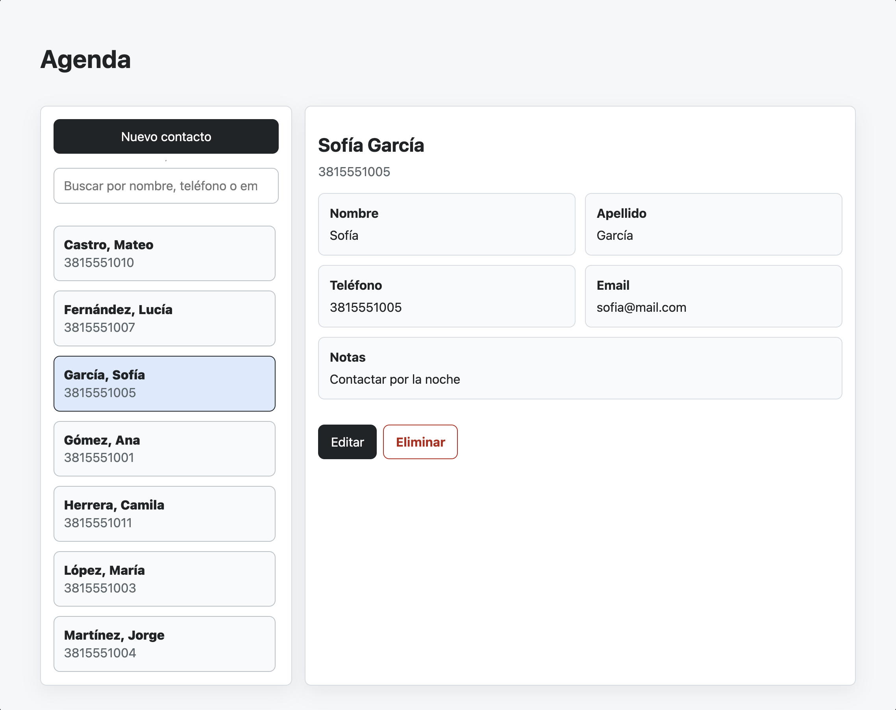
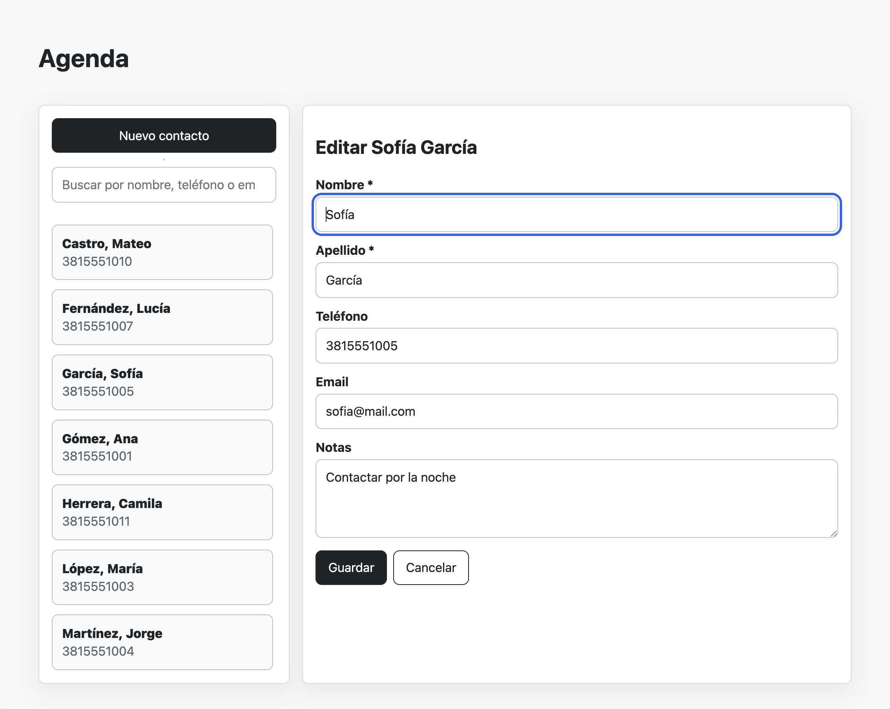

# Agenda Razor HTMX

Aplicacion web maestro-detalle para administrar contactos. Esta hecha con Razor Pages, HTMX y persistencia en SQLite.

## Vista esperada

La interfaz debe verse como las capturas de referencia del proyecto:

### Detalle de contacto



### Edicion de contacto



## Stack

- ASP.NET Core Razor Pages sobre .NET 10.
- HTMX 2 servido localmente desde `wwwroot/js/htmx.min.js`.
- EF Core con SQLite en `agenda.db`.
- Partial Views para actualizar solo los fragmentos necesarios.
- CSS propio en `wwwroot/css/site.css`.
- Sin JavaScript propio y sin API JSON.

## Ejecutar

Compilar:

```bash
dotnet build
```

Iniciar la aplicacion:

```bash
dotnet run
```

Abrir la URL que informe `dotnet run`, normalmente:

```txt
https://localhost:xxxx/
```

o:

```txt
http://127.0.0.1:xxxx/
```

## Comportamiento

- Al abrir la app, se carga la lista completa.
- Si hay contactos, se selecciona automaticamente el primer contacto visible y se muestra su detalle.
- La busqueda filtra en caliente por nombre, apellido, telefono, email y notas.
- Si el contacto seleccionado sigue visible despues de buscar, se conserva la seleccion.
- Si el contacto seleccionado deja de estar visible y hay resultados, se selecciona el primer resultado visible.
- Si la busqueda no devuelve resultados, se limpia el panel de detalle.
- `Agregar` muestra el formulario vacio y limpia la seleccion de la lista.
- `Editar` muestra el formulario con los datos del contacto sin tocar la lista ni mover su scroll.
- Al guardar un contacto nuevo o editado, se muestra su detalle y queda seleccionado en la lista.
- Al eliminar, se borra el contacto, se muestra el mensaje correspondiente y se refresca la lista.

## Mapa HTMX del proyecto

La app usa HTMX con una regla simple: `#detail` cambia por acciones del usuario y `#master` cambia solo al cargar, buscar o despues de una mutacion real de datos.

| Tecnica HTMX                     | Donde aparece                         | Para que se usa                                      |
| -------------------------------- | ------------------------------------- | --------------------------------------------------- |
| `hx-get` + `hx-target`           | Lista, Agregar, Editar, Cancelar      | Pedir un fragmento HTML y ponerlo en `#detail`      |
| `hx-post`                        | Guardar, Eliminar                     | Enviar mutaciones al servidor                       |
| `hx-trigger="load"`              | Carga inicial de lista                | Cargar datos apenas aparece el elemento             |
| `hx-trigger="input changed..."`  | Buscador                              | Filtrar con debounce sin JavaScript                 |
| `hx-include`                     | Busqueda, refresco, eliminar          | Enviar el buscador, la seleccion actual o el token antiforgery |
| `hx-vals`                        | Lista inicial, busqueda y refresco    | Mandar banderas simples como `autoSelect`           |
| `HX-Trigger-After-Swap`          | Handlers de guardar, borrar y agregar | Pedir que `#master` se refresque despues del detalle |
| `hx-confirm`                     | Eliminar                              | Confirmar una accion destructiva                    |

Regla didactica de sincronizacion:

- Seleccionar, editar y cancelar solo reemplazan `#detail`.
- Buscar reemplaza `#master` y puede cargar o limpiar `#detail`.
- Agregar, guardar y eliminar actualizan `#detail` y disparan `refresh-master`.

El estado compartido entre zonas se mantiene minimo: `#current-selection` contiene solo el `selectedId` actual cuando corresponde. Asi `#master` no necesita incluir todo el panel de detalle.

## Endpoints Razor Pages

La pagina principal esta en `/` y usa handlers Razor:

| Request                         | Handler         | Resultado                               |
| ------------------------------- | --------------- | --------------------------------------- |
| `GET /`                         | pagina completa | Render inicial de la aplicacion         |
| `GET /?handler=List`            | `OnGetList`     | Fragmento de lista filtrada y seleccion |
| `GET /?handler=Detail&id=1`     | `OnGetDetail`   | Detalle readonly de un contacto         |
| `GET /?handler=New`             | `OnGetNew`      | Formulario vacio                        |
| `GET /?handler=Edit&id=1`       | `OnGetEdit`     | Formulario de edicion                   |
| `GET /?handler=Empty`           | `OnGetEmpty`    | Mensaje de detalle vacio                |
| `POST /?handler=Save`           | `OnPostSave`    | Crea o actualiza y devuelve el detalle  |
| `POST /?handler=Delete&id=1`    | `OnPostDelete`  | Borra y devuelve mensaje de estado      |

## Datos

La base se crea automaticamente en `agenda.db` al iniciar la aplicacion. Si la tabla de contactos esta vacia, se cargan datos de ejemplo. Los datos persisten entre reinicios.

Los archivos de SQLite generados por la ejecucion local (`agenda.db`, `agenda.db-shm`, `agenda.db-wal` y journals) no deben versionarse.
