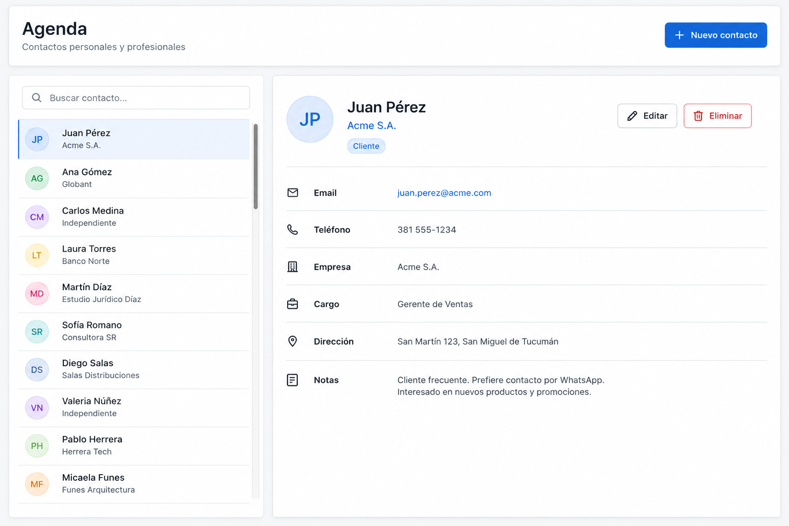
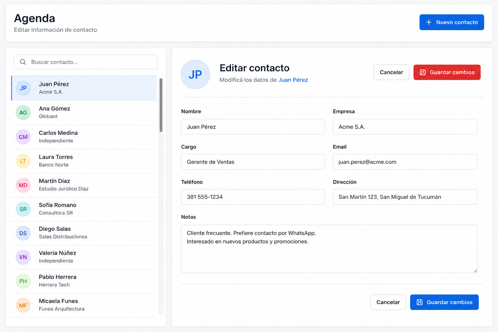

# TP5: AgendaWeb
  
## Agenda de Contactos con Blazor, EF Core y SQLite

> [!IMPORTANT]
> Plazo para entregar el TP4: **Sabado 13 de Junio hasta las 23:59hs**
> *El trabajo es estrictamente individual y debe ser realizado en persona por el alumno*

## Descripción general

El trabajo práctico consiste en desarrollar una aplicación web para gestionar una agenda de contactos.

La aplicación deberá construirse utilizando **Blazor** para la interfaz de usuario, **Entity Framework Core** para el acceso a datos y **SQLite** como motor de base de datos.

El sistema deberá permitir administrar contactos mediante operaciones básicas de alta, consulta, modificación y eliminación.

---

## Objetivo

El objetivo del trabajo es integrar los conceptos fundamentales del desarrollo de una aplicación web con persistencia de datos.

La solución deberá permitir:

- Construir una interfaz web con Blazor.
- Representar contactos mediante un modelo de datos.
- Persistir la información en una base de datos SQLite.
- Acceder a los datos mediante Entity Framework Core.
- Implementar operaciones CRUD sobre los contactos.
- Organizar la interfaz con un diseño maestro/detalle.

---

## Alcance funcional

La aplicación deberá permitir gestionar una agenda de contactos.

Cada contacto deberá representar una persona o entidad registrada en el sistema, con la información necesaria para su identificación y comunicación.

Cada contacto deberá registrar los siguientes datos:

- **Nombre**: nombre de la persona o entidad.
- **Apellido**: apellido de la persona.
- **Teléfono**: número de contacto telefónico.
- **Correo electrónico**: dirección de correo para su comunicación.
- **Empresa**: empresa u organización a la que pertenece el contacto.
- **Cargo**: puesto o función que desempeña el contacto.
- **Dirección**: domicilio o dirección postal del contacto.
- **Fecha de nacimiento**: fecha de nacimiento del contacto (dato opcional).
- **Notas**: comentarios o información adicional sobre el contacto (dato opcional).

Cada contacto contará además con un identificador interno, gestionado automáticamente por el sistema, que permitirá distinguirlo de manera unívoca.

La aplicación deberá permitir:

- Crear nuevos contactos.
- Visualizar la lista de contactos existentes.
- Seleccionar un contacto para ver su información detallada.
- Modificar la información de un contacto.
- Eliminar contactos.
- Buscar o filtrar contactos dentro de la agenda.

---

## Diseño de interfaz

La interfaz deberá organizarse siguiendo un esquema **maestro/detalle**.

El panel maestro deberá presentar la colección de contactos disponibles.

El panel de detalle deberá mostrar la información correspondiente al contacto seleccionado.

El diseño no necesita ser visualmente complejo, pero debe ser claro, ordenado y funcional.

A modo de referencia, las siguientes imágenes muestran un ejemplo de cómo podría verse la aplicación: la vista de detalle de un contacto y el formulario de edición.

| Vista de detalle                              | Edición de un contacto                |
|:---------------------------------------------:|:-------------------------------------:|
|  |  |

---

## Persistencia de datos

La información de los contactos deberá almacenarse en una base de datos SQLite.

El acceso a la base de datos deberá realizarse mediante Entity Framework Core.

La aplicación deberá definir las entidades necesarias, el contexto de base de datos y la lógica requerida para consultar y modificar los datos.

---

## Operaciones principales

La aplicación deberá implementar las operaciones básicas de administración de contactos:

### Crear

Debe ser posible registrar un nuevo contacto en la agenda.

### Consultar

Debe ser posible visualizar los contactos existentes y acceder al detalle de cada uno.

### Modificar

Debe ser posible editar la información de un contacto previamente registrado.

### Eliminar

Debe ser posible eliminar contactos existentes de la agenda.

### Buscar

Debe ser posible buscar o filtrar contactos para facilitar la navegación dentro de la agenda.

---

## Organización del proyecto

La solución deberá estar organizada de manera clara, separando responsabilidades entre las distintas partes de la aplicación.

Se espera una separación razonable entre:

- Modelo de datos.
- Acceso a datos.
- Lógica de aplicación.
- Componentes de interfaz.
- Páginas o vistas principales.

La estructura concreta queda a criterio del estudiante, siempre que resulte comprensible y mantenible.

---

## Criterios generales de evaluación

Se evaluará que la aplicación:

- Implemente correctamente las operaciones CRUD.
- Utilice Blazor para construir la interfaz.
- Utilice Entity Framework Core para el acceso a datos.
- Persista la información en SQLite.
- Organice la interfaz mediante un esquema maestro/detalle.
- Permita buscar o filtrar contactos.
- Mantenga una organización clara del código.
- Presente una experiencia de uso simple y coherente.

---

## Consideraciones finales

El propósito del trabajo es construir una aplicación simple pero completa, que permita integrar interfaz, lógica de aplicación y persistencia de datos.

La prioridad será la correcta implementación funcional y la claridad de la solución.

---

## Cómo comenzar el desarrollo

El proyecto se entrega como un punto de partida mínimo que ya incluye:

- Una aplicación **Blazor** básica con **Bootstrap** configurado, cuya página principal muestra el título *TP5: AgendaWeb*.
- El **modelo de datos** `Contacto`, con los campos descriptos en este enunciado.
- Una base de datos **SQLite** (`contactos.db`) con **20 contactos de ejemplo** ya cargados.
- La librería de acceso a datos (**EF Core para SQLite**) ya referenciada en el proyecto.

A partir de allí, los pasos sugeridos para comenzar son:

1. **Verificar el entorno**: tener instalado el SDK de .NET 10.
2. **Restaurar las dependencias** del proyecto (`dotnet restore`).
3. **Ejecutar la aplicación** (`dotnet run`) y abrir en el navegador la dirección indicada en la consola. Debería verse la página inicial con el título centrado.
4. **Configurar el acceso a datos**: definir el contexto de base de datos (DbContext) que exponga la colección de contactos apuntando a `contactos.db`, y registrarlo en el arranque de la aplicación.
5. **Construir la interfaz** siguiendo el esquema maestro/detalle: una lista de contactos y un panel con el detalle del contacto seleccionado.
6. **Implementar las operaciones CRUD**: crear, consultar, modificar y eliminar contactos.
7. **Agregar la búsqueda o filtrado** de contactos dentro de la agenda.

Se recomienda avanzar de a poco, verificando el funcionamiento de cada parte antes de continuar con la siguiente.
