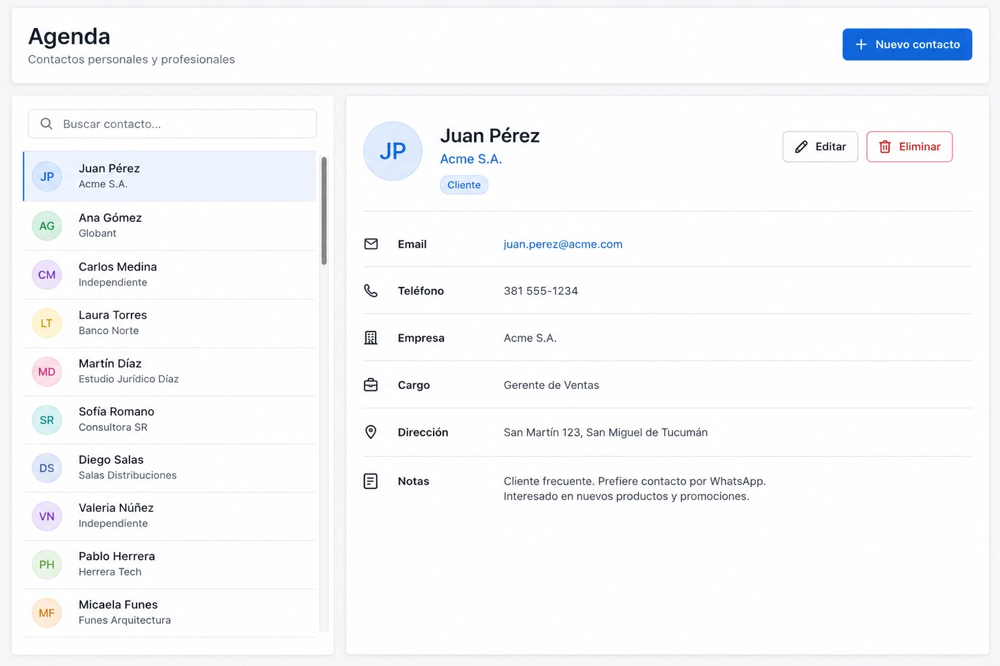
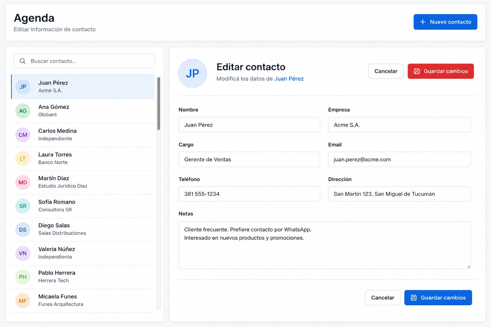

# TP5: AgendaWeb
## Agenda de Contactos con Blazor, EF Core y SQLite

> [!IMPORTANT]
> Plazo para entregar el TP5: **Sábado 13 de Junio hasta las 23:59hs**
>
> *El trabajo es estrictamente individual y debe ser realizado en persona por el alumno*

## Descripción general

Desarrollar una aplicación web para gestionar una **agenda de contactos**, construida con:

- **Blazor** — Interfaz de usuario.
- **Entity Framework Core + SQLite** — Acceso y persistencia de datos.

El sistema debe permitir administrar contactos mediante operaciones de alta, consulta, modificación y eliminación, integrando interfaz, lógica de aplicación y persistencia de datos.

---

## Modelo de datos

Cada contacto representa una persona o entidad registrada en el sistema, y cuenta con un identificador interno gestionado automáticamente que lo distingue de manera unívoca. Sus datos son:

| Campo                | Descripción                                          | Obligatorio |
|----------------------|------------------------------------------------------|:-----------:|
| Nombre               | Nombre de la persona o entidad                       | Sí          |
| Apellido             | Apellido de la persona                               | Sí          |
| Teléfono             | Número de contacto telefónico                        | Sí          |
| Correo electrónico   | Dirección de correo para su comunicación             | Sí          |
| Empresa              | Empresa u organización a la que pertenece            | No          |
| Cargo                | Puesto o función que desempeña                       | No          |
| Dirección            | Domicilio o dirección postal                         | No          |
| Fecha de nacimiento  | Fecha de nacimiento del contacto                     | No          |
| Notas                | Comentarios o información adicional                  | No          |

La información se almacena en una base de datos **SQLite**, y el acceso se realiza mediante **Entity Framework Core**. La aplicación debe definir la entidad, el contexto de base de datos (DbContext) y la lógica para consultar y modificar los datos.

---

## Funcionalidades requeridas

La aplicación debe implementar las operaciones CRUD sobre los contactos:

- **Crear:** registrar un nuevo contacto en la agenda.
- **Consultar:** visualizar la lista de contactos y acceder al detalle de cada uno.
- **Modificar:** editar la información de un contacto existente.
- **Eliminar:** quitar contactos de la agenda.
- **Buscar:** filtrar contactos para facilitar la navegación dentro de la agenda.

---

## Diseño de interfaz

La interfaz debe organizarse siguiendo un esquema **maestro/detalle**:

- **Panel maestro:** la colección de contactos disponibles.
- **Panel de detalle:** la información completa del contacto seleccionado y sus acciones.

El diseño no necesita ser visualmente complejo, pero debe ser claro, ordenado y funcional.

A modo de referencia, las siguientes imágenes muestran un ejemplo de cómo podría verse la aplicación: la vista de detalle de un contacto y el formulario de edición.

| Vista de detalle                              | Edición de un contacto                |
|:---------------------------------------------:|:-------------------------------------:|
|  |  |

---

## Organización del proyecto

La solución debe separar responsabilidades de forma clara, con una estructura comprensible y mantenible. Se espera una separación razonable entre:

- Modelo de datos.
- Acceso a datos.
- Lógica de aplicación.
- Componentes de interfaz.
- Páginas o vistas principales.

La estructura concreta queda a criterio del estudiante.

---

## Cómo comenzar el desarrollo

El proyecto se entrega como un punto de partida mínimo que ya incluye:

- Una aplicación **Blazor** básica con **Bootstrap** configurado, cuya página principal muestra el título *TP5: AgendaWeb*.
- El **modelo de datos** `Contacto`, con los campos descriptos en este enunciado.
- Una base de datos **SQLite** (`contactos.db`) con **20 contactos de ejemplo** ya cargados.
- La librería de acceso a datos (**EF Core para SQLite**) ya referenciada en el proyecto.

Pasos sugeridos:

1. **Verificar el entorno**: tener instalado el SDK de .NET 10.
2. **Restaurar las dependencias** (`dotnet restore`).
3. **Ejecutar la aplicación** (`dotnet run`) y abrir en el navegador la dirección indicada en la consola. Debería verse la página inicial con el título centrado.
4. **Configurar el acceso a datos**: definir el DbContext que exponga la colección de contactos apuntando a `contactos.db`, y registrarlo en el arranque de la aplicación.
5. **Construir la interfaz** siguiendo el esquema maestro/detalle.
6. **Implementar las operaciones CRUD**.
7. **Agregar la búsqueda o filtrado** de contactos.

Se recomienda avanzar de a poco, verificando el funcionamiento de cada parte antes de continuar con la siguiente.
